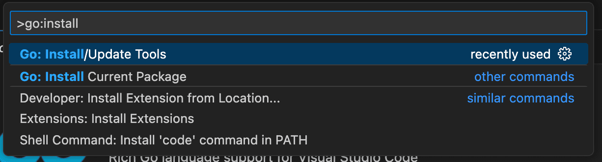
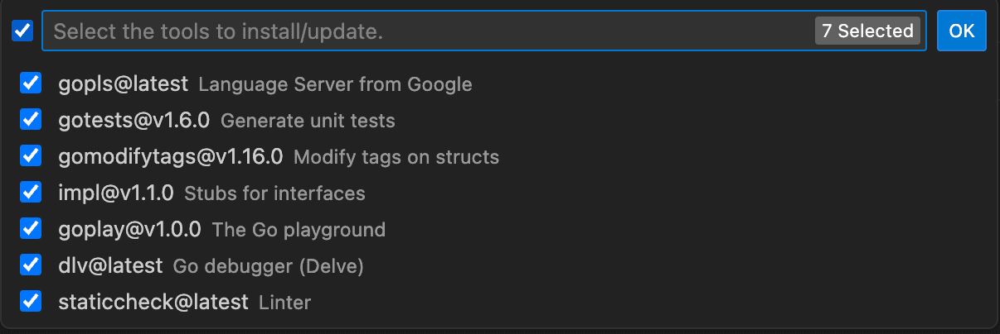
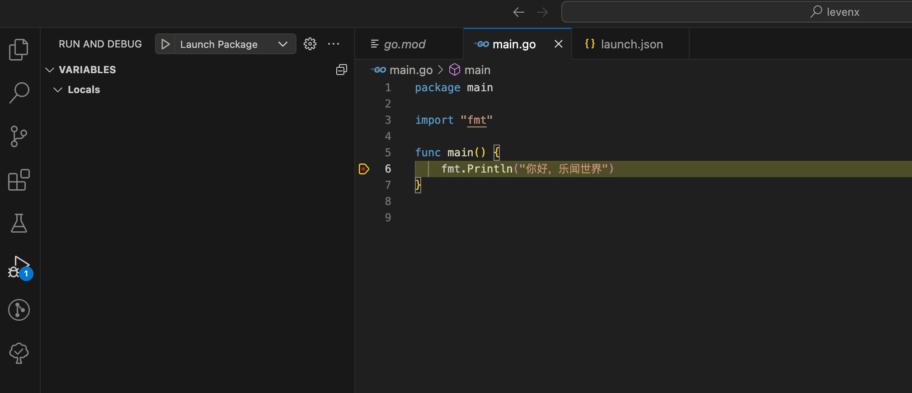
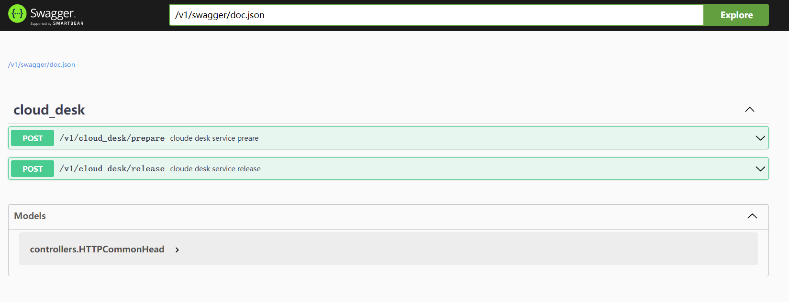

# golang 介绍

Go语言最主要的特性：

- 自动垃圾回收
- 更丰富的内置类型
- 函数多返回值
- 错误处理
- 匿名函数和闭包
- 类型和接口
- 并发编程
- 反射
- 语言交互性

# golang 环境

下载 golang 的安装包：[ Go 安装包下载](https://studygolang.com/dl)

如果你是 M1 之后的 Mac，下载 go1.17.6.darwin-arm64.pkg，否则下载 go1.17.6.darwin-amd64.pkg。之后双击下载的安装包，按提示一步步操作即可。

把安装路径加到 PATH 上 (~/.bashrc)

```shell 
vim ~/.bashrc

export PATH=$PATH:/usr/local/go/bin/
```

查看是否已经安装好。

```shell
$go version
go version go1.19.3 darwin/amd64
```

代理： https://goproxy.io/zh/

**Bash (Linux or macOS)**

```shell
# 配置 GOPROXY 环境变量
export GOPROXY=https://proxy.golang.com.cn,direct
# 还可以设置不走 proxy 的私有仓库或组，多个用逗号相隔（可选）
export GOPRIVATE=git.mycompany.com,github.com/my/private
```

## 环境变量

 3 个环境变量，也就是  `GOROOT`、`GOPATH` 和 `GOBIN`。

 - GOROOT ：golang 安装根目录的路径，也就是 golang 的安装路径。
 - GOPATH：若干工作区目录的路径。是我们自己定义的工作空间。
 - GOBIN：golang  程序生成的可执行文件（executable file）的路径。

## golang 源码的组织方式

golang  语言源码的组织方式就是以环境变量 GOPATH、工作区、src 目录和代码包为主线的。一般情况下，golang 语言的源码文件都需要被存放在环境变量 GOPATH 包含的某个工作区（目录）中的 src 目录下的某个代码包（目录）中。

## 源码安装后的结果

某个工作区的 src 子目录下的源码文件在安装后一般会被放置到当前工作区的 pkg 子目录下对应的目录中，或者被直接放置到该工作区的 bin 子目录中。

那么在安装后如果产生了归档文件（以“.a”为扩展名的文件），就会放进该工作区的 pkg 子目录；如果产生了可执行文件，就可能会放进该工作区的 bin 子目录。

```go
go install github.com/labstack/echo
```

生成的归档文件的相对目录就是 `github.com/labstack`，文件名为 echo.a 。

上面这个代码包导入路径还有另外一层含义，那就是：该代码包的源码文件存在于 GitHub 网站的 labstack 组的代码仓库 echo 中。

## 理解构建和安装 Go 程序的过程


构建使用命令go build，安装使用命令go install。构建和安装代码包的时候都会执行编译、打包等操作。

如果安装的是库源码文件，那么结果文件会被搬运到它所在工作区的 pkg 目录下的某个子目录中。

如果安装的是命令源码文件，那么结果文件会被搬运到它所在工作区的 bin 目录中，或者环境变量GOBIN指向的目录中。

```sh
go build -a       # 目标代码包和依赖包都会被编译。
go build -i       # 编译依赖的代码包,安装归档文件。
go build -x       # 可以看到具体都执行了哪些操作。
go build -n       # 只查看具体操作而不执行它们。
go get -u         # 下载并安装代码包，不论工作区中是否已存在它们。
go get -d         # 只下载代码包，不安装代码包。
go get -fix       # 在下载代码包后先运行一个用于根据当前 Go 语言版本修正代码的工具，然后再安装代码包。
go get -t         # 同时下载测试所需的代码包。
go get -insecure  # 允许通过非安全的网络协议下载和安装代码包。HTTP 就是这样的协议
```

依赖管理工具：glide、gb以及官方出品的dep、vgo。

## go 命令行工具

查看版本:

```sh 
> go version
go version go1.19.3 darwin/amd64
```

查看帮助：

```sh
> go help
Go is a tool for managing Go source code.

Usage:

	go <command> [arguments]

The commands are:

	bug         start a bug report
	build       compile packages and dependencies
	......
	
```

`go tool` 可以完成以下几类工作：

- 代码格式化
- 代码质量分析和修复
- 工程构建
- 代码文档的提取和展示
- 依赖包管理
- 执行其他的包含指令，比如6g等

  
**go vet** 

`go vet` 命令是 `go tool vet` 命令的简单封装。

命令`go vet` 是一个用于检查 Go 语言源码中静态错误的简单工具。

`go vet` 命令可以接受 `-n` 标记和 `-x` 标记。

`go vet` 命令的参数既可以是代码包的导入路径，也可以是 go 源码文件的绝对路径或相对路径。**但是，这两种参数不能混用**。

**指定分支的库**

```
go get  gitlab.vrviu.com/diskless_stack/instance_service/types@分支名
```

## 远程 import 支持

Go 语言不仅允许我们导入本地包，还支持在语言级别调用远程的包。

```go 
package main
import ( 
    "fmt"
    "github.com/myteam/exp/crc32"
)
```

`"github.com/myteam/exp/crc32"` 就是远程的包

然后，在执行`go build`或者`go install`之前，只需要加这么一句: 

```sh
go get github.com/myteam/exp/crc32
```

##  vscode golang 

安装 Go 插件依赖工具

快捷键 Ctrl + Shift + p 打开命令面板，输入go install tools，选择第一项 Go: install/Update Tools





## vscode golang  Debug 断点调试

在程序运行的过程中，将运行程序停在具体的断点处，查询当前程序运行的状态。

vscode 创建 `launch.json`


`launch.json` 文件内容：
```json
{
    "version": "0.2.0",
    "configurations": [
        {
            "name": "Launch Package",
            "type": "go",
            "request": "launch",
            "mode": "auto",
            "program": "${fileDirname}"
        }
    ]
}

```

运行go程序:



参考：

1、[https://www.cnblogs.com/sinberya/p/17593087.html](https://www.cnblogs.com/sinberya/p/17593087.html)
2、【未看】vscode-golang-远程调试 [https://blog.happyhack.io/2023/08/25/vscode-golang-remote-debug/](https://blog.happyhack.io/2023/08/25/vscode-golang-remote-debug/)

## 文档管理 swaggo

可以用 swaggo，根据注释自动生成 API 文档，注释即文档。 [https://github.com/swaggo/swag](https://github.com/swaggo/swag)

**方法** 

在 window 下 安装 swaggo 

1、命令如下： `go get -u github.com/swaggo/swag/cmd/swag`

```sh 
> go get -u github.com/swaggo/swag/cmd/swag
go: downloading github.com/swaggo/swag v1.8.12
go: downloading github.com/urfave/cli/v2 v2.3.0
.......
```

没有在 gopath 中生成 swag.exe 可执行文件 。

要在安装的路径上执行 go install . 

```sh
cd c:\Users\14476\go\pkg\mod\github.com\swaggo\swag@v1.8.12\cmd\swag\
go install 
```

2、在根目录 执行 swag init 。 该目录下要有main.go。 会在根目录下生成 docs 文件夹。 如下：

```sh
C:\kane\dev\service\docs
    docs.go
    swagger.json
    swagger.yaml
```

3、在 routers.go 中设置路由

```go
beego.Handler("/v1/swagger", httpSwagger.Handler(
	httpSwagger.URL("/v1/swagger/doc.json"), //The url pointing to API definition
  ), true)
  beego.SetStaticPath("/swagger", "swagger")
```

我遇到的问题是，看到的例子没有 beego.SetStaticPath("/swagger", "swagger") 导致请求页面失败。 

4、在接口处写好注释如下：

```go
// linksService godoc
//
//  @Summary        linksService
//  @Description    接口描述
//  @Tags           linksService
//  @Accept         json
//  @Produce        json
//  @Param          FlowId      query       string                          false   "流水ID"
//  @Param          Uid         query       int64                           false   "用户ID"
//  @Param          Business    query       int                             false   "业务类型"
//  @Success        200         {object}    HTTPCommonHead{Body=[]string}   "success"
//  @Failure        400         {object}    HTTPCommonHead{}                "failed"
//  @Router         /v1/linksService/release [post]
func (c *MyController) LinkServiceRelease() {
    var req models.LinkServiceReleaseRequest
    body := c.Ctx.Input.RequestBody

    if err := json.Unmarshal(body, &req); err != nil {
        vlog.Errorf("json unmarshal err, body:%+v, err: %s", body, err.Error())
        c.SendRespErrCode(models.ErrorCodeParam, "unmarshal LinkServiceRelease error")
        return
    } 
    vlog.Infof("LinkServiceRelease success, req: %+v, resp: %+v", req, resp)
}
```

5、 请求url : http://localhost:5566/v1/swagger/index.html#! 

这个图片要换掉



到这里，基本上就可以了。

另一个问题 如何安装 swagger.exe 生成 markdown 说明文件 

```sh
swagger generate markdown -f docs/swagger.yaml --output Readme.md
```

方法：[https://tool.4xseo.com/a/30831.html](https://tool.4xseo.com/a/30831.html)

从这里下载 [https://github.com/go-swagger/go-swa](https://github.com/go-swagger/go-swagger/releases)[gger/releases](https://github.com/go-swagger/go-swagger/releases) 下载 swagger_windows_amd64.exe 然后放到 gobin 的目录中。

执行 ：swagger generate markdown -f docs/swagger.yaml --output Readme.md

生成如下：　这


生成这个说明文档，也不能满足接口说明的要求，如果返回值的类型，就无法很好的体现出来。也可能是我还没搞明白吧，还是自己写文档吧。

>感觉beego 并不能很友好的支持 swaggo   。
> 按照例子试了很久，页面也没有请求出来。网上看到有人说是 
> beego swagger的坑——要设置swagger路由 (https://blog.51cto.com/3xxx/3023955) 
> 必须在route的namespace下面设置swagger路由 `beego.SetStaticPath("/swagger", "swagger")`
> 
> 试了一下，可以用，请求地址是：http://localhost:5566/v1/swagger/index.html#!


参考：

1、[https://juejin.cn/post/7126802030944878600](https://juejin.cn/post/7126802030944878600)

2、[https://swagger.io/docs/](https://swagger.io/docs/)

3、[https://swagger.io/docs/](https://www.lixueduan.com/posts/go/swagger/)


## 工程构建

支持 makefile 方式

golang 可以用 makefile 的方式编译文件。

如：build 的时候加  -ldflags， 可以把一些信息编译入程序中。 方便后续定位。

```makefile
REPO = kakaxi.github.com/golang-test/link-service

GIT_COMMIT := $(shell git show-branch --no-name HEAD)
GIT_BRANCH := $(shell git rev-parse --abbrev-ref HEAD)
GIT_DIRTY := $(shell test -n "`git status --porcelain`" && echo "*" || true)
BUILD_VERSION := $(shell git describe --abbrev=10 --tags --always)
BUILD_TIME := $(shell date +%FT%T%z)

LDFLAGS := "\
-X \"${REPO}/internal/version.buildGitCommit=${GIT_COMMIT} ${GIT_DIRTY}\" \
-X \"${REPO}/internal/version.buildGitBranch=${GIT_BRANCH}\" \
-X \"${REPO}/internal/version.buildVersion=${BUILD_VERSION}\" \
-X \"${REPO}/internal/version.buildTime=${BUILD_TIME}\""

all: release

.PHONY: debug
debug:
  go vet ./...
  go build -ldflags $(LDFLAGS)
  
.PHONY: release
release:
  go vet ./...
  GOWORK=off go build -ldflags $(LDFLAGS)
  
.PHONY: docs
docs:
  swag init
```


## golang 包

可以区别空间（一个文件夹中不能有两个同名的文件），也可以更好的管理项目。 一般一个包对应一个文件夹。文件夹中的go 文件都是使用 package 关键字声明名的名称。 文件夹名和包通常相同。 

**包导入**

```go 
package fmt 

import (
	"io"
  "sync"
)
```

**包的注意事项: **

一个文件夹只有一个 package 
  - import 后面的是 `GOPATH` 开始的相对目路径，包括最后一段。但由于一个目录下只能有一个 package, 所以 import 一个路径就等于是 import 了这个路径下的包。 
  - 如果有子目录，那么子目录和父目录是完全两个包。 
  
一个 package 的文件不能在多个文件夹下
  - 如果多个文件夹下有重名的 package ，它们是彼此无关的 package 。
  - 如果一个 go 文件需要同时使用不同目录下的同名 package, 需要在 import 这些目录时为每一个目录指定一个 package 的别名。 
# 变量

Go 语言的变量声明方式与 C 和 C++ 语言有明显的不同。对于纯粹的变量声明，G o语言引入了关键字 var，而类型信息放在变量名之后。

```go 

var v1 int
var v2 string 
var v3 [10] int  // 数组 
var v4 [] int    // 数组切片 

var v5 struct {
    f int
    v string
}

var v6 * int // 指针
var v7 map[string] int  // map，key为string类型，value为int类型
var v8 func (a int) int // 函数变量

```

变量声明语句不需要使用分号作为结束符。

var 关键字的另一种用法是可以将若干个需要声明的变量放置在一起，免得程序员需要重复 写 var 关键字。

## 变量初始化

对于声明变量时需要进行初始化的场景，var关键字可以保留，但不再是必要的元素。

```go 
var v1 int  = 10 // 方法一，规范方式
var v2 = 10      // 方法二
v3 := 10         // 方法三，偷懒方法，常用
```

冒号和等号的组合`:=`，用于明确表达同时进行变量声明和初始化的工作。

## 变量赋值

多重赋值：
```go 
i, j = j, i
```

## 匿名变量

我们在使用传统的强类型语言编程时，经常会出现这种情况，即在调用函数时为了获取一个 值，却因为该函数返回多个值而不得不定义一堆没用的变量。在 Go 中这种情况可以通过结合使 用多重返回和匿名变量来避免这种丑陋的写法，让代码看起来更加优雅。

如：
```go 
_, _, nickName := GetName()
```

## 变量后面的点后面直接跟括号

1、类型转换

```go
value.(string)
```

2、获取类型，使用场景有限制

```go
switch value.(type) {
    case string:
}
```

# 常量

常量是指编译期间就已知且不可改变的值。常量可以是数值类型(包括整型、浮点型和复数类型)、布尔类型、字符串类型等。

## 字面常量

所谓字面常量(literal)，是指程序中硬编码的常量。

```go 
3.14159265358979323846 // 浮点类型的常量
"foo"                  // 字符串常量
true                   // 布尔类型的常量
```

## 常量定义

通过const关键字，你可以给字面常量指定一个友好的名字: 
```go 
const Pi float64  = 3.14159265358979323846

const (
    size int64 = 1024 
    eof = -1
)
```

## 预定义常量

Go 语言预定义了这些常量: `true`、`false` 和 `iota`。

`iota` 比较特殊，可以被认为是一个可被编译器修改的常量，在每一个 const 关键字出现时被重置为 0，然后在下一个const 出现之前，每出现一次 iota，其所代表的数字会自动增1。

```go 
const (
    c0 = iota   // c0 = 0
    c1 = iota   // c1 = 1
    c2 = iota   // c2 = 2
)

const (
    a = 1 << iota  // a == 1 
    b = 1 << iota  // b == 2
    c = 1 << iota  // c == 4
)
```

如果两个 const 的赋值语句的表达式是一样的，那么可以省略后一个赋值表达式。

```go 
const (
    c0 = iota   // c0 = 0
    c1          // c1 = 1
    c2          // c2 = 2
)

const (
    a = 1 << iota  // a == 1 
    b              // b == 2
    c              // c == 4
)
```

## 枚举

```go 
const (
    Sunday = iota
    Monday
    Tuesday
    Wednesday
    Thursday
    Friday
    Saturday
    numberOfDays
)
```

同 golang 语言的其他符号(symbol)一样，以**大写字母开头的常量在包外可见**。以上例子中 numberOfDays 为包内私有，其他符号则可被其他包访问。

参考: 
1、[https://www.cnblogs.com/zsy/p/5370052.html](https://www.cnblogs.com/zsy/p/5370052.html)
# 类型

基础类型 (Basic Types)

- 布尔型（Boolean）：bool，值为true或false。
- 数字类型：包括整数和浮点数。
- 整数类型：int、int8、int16、int32、int64。int的大小取决于运行环境，通常为32位或64位。
- 无符号整数类型：uint、uint8、uint16、uint32、uint64。
- 浮点数类型：float32、float64。
- 复数类型：complex64、complex128。
- 字符串类型：string，用于表示文本。
- 字节类型：byte，等同于uint8，用于表示ASCII字符。
- 运行时类型：interface{}，可以接受任何类型的值。

复合类型 (Composite Types)

- 数组（Array）：固定长度的序列，所有元素都是同一类型。
- 切片（Slice）：动态大小的序列，可以包含任何类型的元素。
- 结构体（Struct）：用于组合数据，可以包含不同类型的字段。
- 映射（Map）：键值对的集合，键和值可以是任何类型。
- 通道（Channel）：用于在协程之间传递数据的通道。
- 函数（Function）：定义了一组参数和返回值的函数类型。
- 指针（Pointer）：指向其他变量的内存地址的类型。

## 布尔类型

关键字为bool，可赋值为预定义的 true 和 false。

```go 
var  v1 bool
v1 = true
v2 := (1 == 2) // v2也会被推导为bool类型
```

布尔类型不能接受其他类型的赋值，不支持自动或强制的类型转换。

## 整型

go 所支持的类型和长度： 


使用强制类型转换：

```go 
value2 = int32(value1) // 编译通过
```

在做强制类型转换时，需要注意数据长度被截短而发生的数据精度损失(比如将浮点数强制转为整数)和值溢出(值超过转换的目标类型的值范围时)问题。

数值运算： `+`、`-`、`*`、`/`  和`%`

比较运算: `>、<、==、>=、<=  、!=` 

位运算: 

注意取反的	


## 浮点型

Go 语言定义了两个类型 `float32` 和` float64` 。

浮点数比较： 因为浮点数不是一种精确的表达方式，所以像整型那样直接用 ==  来判断两个浮点数是否相等 是不可行的，这可能会导致不稳定的结果。

```go 
import "math"

// p为用户自定义的比较精度，比如0.00001 
func IsEqual(f1, f2, p float64) bool {
    return  math.Fdim(f1, f2) < p 
}

```

## 复数类型

复数表示:

```go 
var value1 complex64

value1 = 3.2 + 12i
value2 := 3.2 + 12i
value3 := complex(3.2, 12)

```

实部与虚部:

对于一个复数 `z = complex(x, y)`，就可以通过 Go 语言内置函数`real(z)`获得该复数的实部，也就是 x，通过 `imag(z)` 获得该复数的虚部，也就是 y 。 

## 字符串

字符串的声明和初始化如下： 

```go 
var str string // 声明一个字符串变量
str = "Hello world" // 字符串赋值
ch := str[0] // 取字符串的第一个字符
fmt.Printf("The length of \"%s\" is %d \n", str, len(str))
fmt.Printf("The first character of \"%s\" is %c.\n", str, ch)
```

字符串的内容可以用类似于数组下标的方式获取，但与数组不同，字符串的内容不能在初始 化后被修改。

## 字符类型

在 golang 中支持两个字符类型，

`uint8` 类型，或叫 `byte` 型。代表了 ASCII 码的一个字符。

`rune` 类型，代表一个 UTF-8 字符，当需要处理复合字符时，则需要用到 `rune` 类型。 `rune` 类型等价 `int32` 类型。

传统 ASCII 编码只占用 1 个字节，所以可以用 byte 类型来表示， 如 

```go
var ch byte='A' 		// 字符使用单引号括起来。
var ch byte = 65 		// 十进制表示
var ch byte = '\x41'    //（\x 总是紧跟着长度为 2 的 16 进制数）
```

在书写 `Unicode` 字符时，需要在 16 进制数之前加上前缀\u或者\U。因为 `Unicode` 至少占用 2 个字节，所以我们使用 `int16` 或者 `int` 类型来表示。如果需要使用到 4 字节，则使用`\u`前缀，如果需要使用到 8 个字节，则使用`\U`前缀。

```go
var ch1 int = '\u0041'
var ch2 int = '\u03B2'
var ch3 int = '\U00101234'
```

Unicode 包中内置了一些用于测试字符的函数，这些函数的返回值都是一个布尔值，如下所示（其中 ch 代表字符）：

- 判断是否为字母：unicode.IsLetter(ch)
- 判断是否为数字：unicode.IsDigit(ch)
- 判断是否为空白符号：unicode.IsSpace(ch)

## 数组

数组中包含的每个数据被称为数组元素(element)，一个数组包含的元素个数被称为数 组的长度。

以下为一些常规的数组声明方法:

```go 
[32] byte                     // 长度为32的数组，每个元素为一个字节 
[2*N] struct { x, y _int32_ } // 复杂类型数组
[1000] * float64              // 指针数组
[3][5] int                    // 二维数组
[2][2][2] float64             // 等同于[2]([2]([2]float64))
```

组长度在定义后就不可更改，在声明时长度可以为一个常量或者一个常量表达式(常量表达式是指在编译期即可计算结果的表达式)。数组的长度是该数组类型的一个内 置常量，可以用 Go 语言的内置函数 `len()` 来获取。

```go 
arrLength := len(arr)
```

**元素访问**

可以使用数组下标来访问数组中的元素。与 C 语言相同，数组下标从 0 开始，`len(array)-1` 则表示最后一个元素的下标。下面的示例遍历整型数组并逐个打印元素内容:

```go 
for i := 0; i < len(array); i++ {
    fmt.Println("Element", i, "of array is ", array[i]); 
}
```

Go 语言还提供了一个关键字 `range`，用于便捷地遍历容器中的元素。当然，数组也是 `range` 的支持范围。上面的遍历过程可以简化为如下的写法:

```go 
for i, v := range array {
   fmt.Println("Array element [", i, "]=", v)
}
```

**值类型**

在 Go 语言中数组是一个值类型(value type)。所有的值类型变量在赋值和作为参数传递时都将产生一次复制动作。如果将数组作为函数的参数类型，则在函数调用时该参数将发生数据复制。因此，在函数体中无法修改传入的数组的内容，因为函数内操作的只是所传入数组的一个副本。

## 切片 slice

切片 slice 就像一个指向数组的指针。实际上它拥有自己的数据结构，而不仅仅是个指针。数组切片的数据结构可以抽象为以下3个变量:

- 一个指向原生数组的指针。
- 数组切片中的元素个数。
- 数组切片已分配的存储空间。

**创建数组切片**

创建数组切片的方法主要有两种——基于数组和直接创建。

**基于数组**

数组切片可以基于一个已存在的数组创建。数组切片可以只使用数组的一部分元素或者整个数组来创建，甚至可以创建一个比所基于的数组还要大的数组切片。

```go 
// 先定义一个数组
var myArray [10] int = [10] int {1, 2, 3, 4, 5, 6, 7, 8, 9, 10 } // 基于数组创建一个数组切片
var mySlice [] int = myArray[:5]

```

`myArray[first:last]` 这样的方式来基于数组生成一 个数组切片。

基于myArray的所有元素创建数组切片:  `mySlice = myArray[:]`
基于myArray的前5个元素创建数组切片:`mySlice = myArray[:5]`
基于从第5个元素开始的所有元素创建数组切片: `mySlice = myArray[5:]`

**直接创建**

并非一定要事先准备一个数组才能创建数组切片。Go 语言提供的内置函数 `make()` 可以用于灵活地创建数组切片。

创建一个初始元素个数为5的数组切片，元素初始值为0:
```go 
mySlice1 := make([] int, 5) 
```

创建一个初始元素个数为5的数组切片，元素初始值为0，并预留10个元素的存储空间:
```go 
mySlice2 := make([] int, 5, 10) 
```

直接创建并初始化包含5个元素的数组切片:
```go 
mySlice3 := [] int {1, 2, 3, 4, 5}
```

**元素遍历**

```go 
for i := 0; i <len(mySlice); i++ { 
    fmt.Println("mySlice[", i, "] =", mySlice[i])
}
```

使用 `range` 关键字可以让遍历代码显得更整洁。range表达式有两个返回值，第一个是索引，第二个是元素的值:

```go 
for i, v := range mySlice { 
    fmt.Println("mySlice[", i, "] =", v)
}
```

**动态增减元素**

当存储的数据比创建时设置的多时，数组切片会自动的重新分配。

`cap()`:  返回的是数组切片分配的空间大小。
`len()` :  返回的是 数组切片中当前所存储的元素个数。
`append()`: 从后面追加数据。第二个参数其实是一个不定参数，我们可以按自己需求添加若干个元素，甚至直接将一个数组切片追加到另一个数组切片的末尾。

```go 
mySlice = append(mySlice, 1, 2, 3)

mySlice2 := []_int_{8, 9, 10}

// 给mySlice后面添加另一个数组切片
mySlice = append(mySlice, mySlice2...)
```

实现方式：

```go
func appendInt(x []int, y int) []int {
    var z []int
    zlen := len(x) + 1
    
    if zlen <= cap(x) {
        z = x [:len]
    }else {
        zcap := zlen
        if cap < 2*len(x) {
            zcap = 2* len(x)
        }
        z = mak([]int, zlen, zcap)
        copy(z, x)
    }
    z[len(x)] = y
    return z
}
```
`copy()` : 将内容从一个数组切片复制到另一个数组切片。

**其他：**

1、slice 的语法和数据有很像，只是没有固定长度。
2、多个 slice 之间可以共享底层的数据，并全引用的数组部分区间可能重叠。
3、和数组不同的时是,slice 之间不能比较。因此我们不能使用 == 操作来判两个 slice 是否含有全部相等元素。
4、之所以不直接比较去运算符，有两方面，一是 slice 的元素是间接引用，一个 slice 甚至可以包含自身。二是 slice 在不同的时间可能包含不同元素，底层数据的元素可能会被修改。
5、测试一个 slice 是否是空的， `len(s) == 0`, 不应该用`s==nil` 来判断。
6、`x[m:n]` 切处操作对于字符串则生成一个新字符串，如果x是`[]byte`的话则生成一个新`[]byte`。


##  map 

map是一堆键值对的未排序集合，底层是用**哈希表**做的。

变量声明：

```go
var myMap map[string] PersonInfo
```

内置的函数make()来创建:

```go 
myMap = make(map[string] PersonInfo)
```

元素赋值:

```go 
myMap["1234"] = PersonInfo{"1", "Jack", "Room 101,..."}
```

元素删除用内置函数`delete()`

```go 
delete(myMap, "1234")
```

元素查找:

```go 
value, ok := myMap["1234"]
if ok{// 找到了

// 处理找到的value 
}
```

其他：

1、不能对 map 的元素进行取址操作 
```go 
_ = &ages["bob"] // compile error :cannot take address of map `elemnet
```

2、随着 map 的元素的增多，可能会重新进行分配空间。

3、和 clice一样，map之间不能进行相等的比较，唯一的例外是和 nil 进行比较。要判断两个是否包含相同的 key 和 value。要循环一个一个来。

## 结构体

通常一行对应一个结构体成员，成员的名字在前类型在后，不过如果相邻的成员类型如果相同的话，可以被合并到一行。

```go
type Employee struct {
    ID int
    Name, Address string
    Dob time.Time
}
```

1、结构体成员的输入顺序也有重要的意义。 如果要交换 Name 和 Address 出现的顺序，那么就是定义不同的结构类型。

2、如果结构体成员名字是以大写字母开头的，那么成员就是导出的，这是 GO 语言导出决定的。一个结构体可能同时包含导出和未导出的成员。

3、一个命名为 S 的结构体类型不能含有 S 类型的成员。因为一个聚合的值不能包含它自身。但是 S 类型的结构可以包含`*S`指针类型成员。

4、结构体的零值是每个成员都是零值。

5、结构体没有任何成员的是空结构体，写作`struct{}`。它的大小为 0,不包含任何信息。

6、如果考虑效率的话，较大的结构体通常会用指针的方式传入和返回。

7、结构体嵌入和匿名成员。Go 语言有一个特性让我们只声明一个成员对应的数据类型而不指名成员的名字，这类成员就是叫匿名成员。匿名成员的数据类型必须是命名的类型或指向一个命名的类型的指针。

8、不能同进包含两个类型相同的匿名成员，这会导致名字冲突。成员的名字是由其类型隐匿地决定的。

```go
type Point struct{
    x, y int
}

type Cirecle struct {
    Point
    Radius int
}

type Wheel struct{
    Circle
    Spokes int
}
```


## Json 

在 golang  中，结构体系和 json 是可以相互相转换的。

如通过下面的代码

```go 
type address struct {
	Street  string `json:"street"`
	Ste     string `json:"suite,omitempty"`
	City    string `json:"city"`
	State   string `json:"state"`
	Zipcode string `json:"zipcode"`
}
```

```json 
{
    "street": "200 Larkin St",
    "suite": "", // 这个字段不展示
    "city": "San Francisco",
    "state": "CA",
    "zipcode": "94102"
}
```

其实中，结构体中的 `omitempty ` 表示，如果Ste没有值，则序列化时不展示这个字段。 	

`omitempty` 在用时，会一个地方要注意的，即无法直接忽略掉嵌套结构体。如：

```go 
type address struct {
	Street     string     `json:"street"`
	Ste        string     `json:"suite,omitempty"`
	City       string     `json:"city"`
	State      string     `json:"state"`
	Zipcode    string     `json:"zipcode"`
	Coordinate coordinate `json:"coordinate,omitempty"`
}

type coordinate struct {
	Lat float64 `json:"latitude"`
	Lng float64 `json:"longitude"`
}
```

`Coordinate` 是 嵌套结构体，并使用了 `omitempty` 关键字。但是在序列化成 json 时则还是无法忽略掉这个字段 。 

```joson
{
    "street": "200 Larkin St",
    "city": "San Francisco",
    "state": "CA",
    "zipcode": "94102",
    "coordinate": {
        "latitude": 0,
        "longitude": 0
    }
}
```

想要达到忽略掉嵌套结构体的目的，就要使用指针才行。如下：

```go 
type address struct {
	Street     string      `json:"street"`
	Ste        string      `json:"suite,omitempty"`
	City       string      `json:"city"`
	State      string      `json:"state"`
	Zipcode    string      `json:"zipcode"`
	Coordinate *coordinate `json:"coordinate,omitempty"`
}

type coordinate struct {
	Lat float64 `json:"latitude"`
	Lng float64 `json:"longitude"`
}
```


另一个要注意的地方，是标记 `omitempty `关键字的 字段，如果赋值正好是默认为空的时候，它也是会被忽略掉的。 同样道理，要将结构体内的定义换成指针，如下：

```go 
type coordinate struct {
	Lat float64 `json:"latitude,omitempty"`
	Lng float64 `json:"longitude,omitempty"`
}
```

当 `Lat` 、`Lng` 默认为 0 时，则输出了空 `{}` 。

```go 
type coordinate struct {
	Lat *float64 `json:"latitude,omitempty"`
	Lng *float64 `json:"longitude,omitempty"`
}
```

当用指针来有定义时，则可以输出默认值为0的情况 。

```json 
{
    "latitude": 0,
    "longitude": 0
}
```


## 三目运算

golang  为什么没有三目运算？

1、[https://voidint.github.io/post/golang/conditional-expressions/](https://voidint.github.io/post/golang/conditional-expressions/)

2、[https://go.dev/doc/faq#Does_Go_have_a_ternary_form](https://go.dev/doc/faq#Does_Go_have_a_ternary_form)


# 流程控制

流程控制只是为了控制程序语句的执行顺序，一般需要与各种条件配合，因此， 在各种流程中，会加入条件判断语句。流程控制语句一般起以下3个作用：

- **选择**，即根据条件跳转到不同的执行序列。
- **循环**，即根据条件反复执行某个序列，当然每一次循环执行的输入输出可能会发生变化。
- **跳转**，即根据条件返回到某执行序列。

Go 语言支持如下的几种流程控制语句:

- **条件语句**，对应的关键字为if、else 和 else if。
- **选择语句**，对应的关键字为switch、case 和select (将在介绍channel的时候细说)。
- **循环语句**，对应的关键字为 for 和 range。
- **跳转语句**，对应的关键字为 goto。

左花括号`{`必须与`for` 处于同一行。
如：

```go 
// if 
if a < 5 { 
    return 0
} else { 
    return 1
}

// switch 
switch i { 
    case 0:
        fmt.Printf("0") 
    case 1:
        fmt.Printf("1") 
    case 2:
        fallthrough 
    case 3:
        fmt.Printf("3") 
    case 4, 5, 6:
         fmt.Printf("4, 5, 6") 
    default:
        fmt.Printf("Default")
}

// for 
sum := 0
for i := 0; i < 10; i++ {
    sum += i 
}

// break，可以选择中断哪一个循环
for j := 0; j < 5; j++ {
    for i := 0; i < 10; i++ {
        if i > 5 { 
            break JLoop
        }
        fmt.Println(i)
    } 
}

JLoop: 
// ...

```

# 函数

函数的定义：

```go 
package mymath 
import "errors"

func Add(a int, b int) (ret int, err error) {

    if a < 0 || b < 0 { // 假设这个函数只支持两个非负数字的加法
        err= errors.New("Should be non-negative numbers!")
       return
    }

    return a + b, nil // 支持多重返回值 
}
```

如果参数列表中若干个相邻的参数类型的相同，比如上面例子中的 a 和 b，则可以在参数列表中省略前面变量的类型声明，如果返回值列表中多个返回值的类型相同，也可以用同样的方式合并。

```go 
func  Add(a, b _int_) int { 
   // ...
}
```

函数调用:

函数调用非常方便，只要事先导入了该函数所在的包。

```go
import "mymath"// 假设Add被放在一个叫mymath的包中 // ...

c := mymath.Add(1, 2)
```

Go 语言中函数名字的大小写不仅仅是风格，更直接体现了该函数的可见性。**写字母开头的函数只在本包内可见，大写字母开头的函数才能被其他包使用。**

## 不定参数

**1、不定参数类型**

不定参数是指函数传入的参数个数为不定数量。

```go 
func myfunc(args ..._int_) {
    for _, arg := range args {
        fmt.Println(arg)
    }
}

// 方式调用:
myfunc(2, 3, 4)
myfunc(1, 3, 7, 13)
```
形如 `...type` 格式的类型只能作为函数的参数类型存在，并且必须是最后一个参数。

类型`...type` 本质上是一个数组切片，也就是[]type，这也是为 什么上面的参数 args 可以用 for 循环来获得每个传入的参数。

**2、 不定参数的传递**

有另一个变参函数叫做`myfunc3(args ...int)`，下面的例子演示了如何向其传递变参:

```go 
func myfunc(args ..._int_) { // 按原样传递
    myfunc3(args...)
   // 传递片段，实际上任意的int slice都可以传进去
   myfunc3(args[1:]...)
}
```

**3、任意类型的不定参数**

如果希望传任意类型，可以指定类型为 `interface{}`。下面是 Go 语言标准库中 `fmt.Printf()` 的函数原型:

```go
func Printf(format _string_, args ...interface{}) { // ...

}
```

## 多返回值

go 语言的函数可以用多个返回值如：

```go
func (file *File) Read(b []_byte_) (n int, err Error)
```

Go语言并不需要强制命名返回值，但是命名后的返回值可以让代码更清晰，可读性更强， 同时也可以用于文档。

## 匿名函数

**匿名函数**是指不需要定义函数名的一种函数实现方式。函数可以像普通变量一样被传递或使用。匿名函数可以直接赋值给一个变量或者直接执行：

```go 
f := func(x, y int) int { 
   return x + y
}
```

## 闭包

闭包可以理解成定义在一个函数内部的函数。在本质，闭包是将函数内部和函数外部连接起来的桥梁。或者说是函数和其此乃环境的组合体。 

闭包指的是一个函数和与其相关的引用环境组合而成的实体。简单来说，闭包=函数+引用环境。	


```go
package main

import "fmt"

func add() func(int) int {
	var x int
	return func(y int) int {
		x += y
		return x
	}
}

func main() {
	var f = add()

	fmt.Println(f(10))
	fmt.Println(f(20))
	fmt.Println(f(30))
	fmt.Println("------------")

	f1 := add()
	fmt.Println(f1(40))
	fmt.Println(f1(50))
}

```

输出结果：

```sh
10
30
60
------------
40
90
```


变量  f 是一个函数并且它引用了其外部作用域中的 x 变量，此时 f 就是一个闭包。**在 f 的生命周期内，变量 x 也是一直有效**。


例子：

```go
package main

import "fmt"

func cal(base int) (func(int) int, func(int) int) {
	add := func(a int) int {
		base += a
		return base
	}
	sub := func(a int) int {
		base -= a
		return base
	}
	return add, sub
}

func main() {

	add, sub := cal(100)
	r := add(100)
	fmt.Printf("r:%v\n", r)
	r = sub(50)
	fmt.Printf("r:%v\n", r)

	add1, sub1 := cal(100)
	r = add1(1)
	fmt.Printf("r:%v\n", r)
	r = sub1(2)
	fmt.Printf("r:%v\n", r)
}
```


## init 函数

golang 有一个特殊的函数 `init `函数，先于`main`函数执行，作用实现包的一些初始化操作。 


**init 函数的特点**： 

- init 函数先于 main 函数自动执行， 不能被其他函数调用。
- init 函数没有输入参数和返回值。
- 每个包可以有多个init 函数
- 包的每个源文件也可以有多个init 函数。
- 同一个包的init 执行顺序，golang 没有明确的定义，所以要逻辑注意不要依赖这个执行顺序。
- 不同包的init 函数按照包饿的依赖关系决定挂靠顺顺序。


**golang 初始化顺序**

初始化顺序： 变量初始化->` init()`-> `main()`

如：

```go
package main

import "fmt"

var i int = initVer()

func init() {
	fmt.Println("0 : init......")
}

func initVer() int {
	fmt.Println("0 : initVer.....")
	return 100
}

func main() {
	fmt.Println("1 : main......")
}
```

结果：

```sh
0 : initVer.....
0 : init......
1 : main......

Program exited.
```


# 错误处理

## error 接口

Go 语言引入了一个关于错误处理的标准模式，即 error 接口，该接口的定义如下：

```go 
type error interface { 
    Error() string
}
```

##  defer 函数

当 defer 语句被执行时，跟在 defer 后面的函数会被延迟执行。直到包含该 defer 语句的函数执行完毕时，defer 后的函数才会被执行，不论包含 defer 语句的函数是通过 return 正常结束，还是由于 panic 导致的异常结束。你可以在一个函数中执行多条 defer 语句。如：

```go 
func CopyFile(dst, src _string_) (w _int64_, err error) { 

    srcFile, err := os.Open(src)
    if err != nil {
        return
    }

    defer srcFile.Close()
    dstFile, err := os.Create(dstName) 
    if err != nil {
        return
    }

    defer dstFile.Close()

    return io.Copy(dstFile, srcFile) 
}
```

defer 语句的调用是遵照 **先进后出的原则，即最后一个defer语句将最先被执行**。

defer 语句经常被用于处理成对的操作，如打开、关闭、连接、断开连接、加锁、释放锁。释放资源的 defer 应该直接跟在请求资源的语句后。

调试复杂程序时，defer机制也常被用于记录何时进入和退出函数。下例中的bigSlowOperation函数，直接调用trace记录函数的被调用情况。通过这种方式，我们可以只通过一个语句控制函数的入口和所有的出口，甚至可以记录函数的运行时间，需要注意一点：不要忘记defer语句的圆的括号。

```go

func bigSlowOperation() {

defer trace("bigSlowOperation")() // don't forget the

extra parentheses

// ...lots of work…

time.Sleep(10 * time.Second) // simulate slow

operation by sleeping

}

func trace(msg string) func() {

start := time.Now()

log.Printf("enter %s", msg)

return func() {

log.Printf("exit %s (%s)", msg,time.Since(start))

}
}
```

## panic() 和 recover() 函数

Go 语言引入了两个内置函数 `panic()` 和`recover()` 以报告和处理运行时错误和程序中的错误场景。简单的说是：抛出一个panic 的异常，然后在 defer 中通过 recover 捕获这个异常，然后正常处理。

```go 

package main

import "fmt"

func main(){
    fmt.Println("c")
     defer func(){ // 必须要先声明defer，否则不能捕获到panic异常
        fmt.Println("d")
        if err:=recover();err!=nil{
            fmt.Println(err) // 这里的err其实就是panic传入的内容，55
        }
        fmt.Println("e")
    }()

    f() //开始调用f
    fmt.Println("f") //这里开始下面代码不会再执行
}

func f(){
    fmt.Println("a")
    panic("异常信息")
    fmt.Println("b") //这里开始下面代码不会再执行
    fmt.Println("f")
}
```

输出结果：
```shell
c
a
d
异常信息
e
```

# 反射


反射( reflection )是在 Java 出现后迅速流行起来的一种概念。通过反射，你可以获取丰富的类型信息，并可以利用这些类型信息做非常灵活的工作。

## 基本概念

Type 和 Value，它们也是 Go 语言包中 reflect 空间里最重要的两个类型。

对所有接口进行反射，都可以得到一个包含 Type 和 Value 的信息结构。

如：

```go 
var reader io.Reader
reader = &MyReader{"a.txt"}
```
对上例的 reader 进行反射，也将得到一个 Type 和 Value。 

Type 为 `io.Reader`，Value 为 `MyReader{"a.txt"}`。

顾名思义，Type主要表达的是被反射的这个变量本身的类型信息，而Value则为该变量实例本身的信息。

## 基本用法

## 获取类型信息

```go
package main
import ( 
    "fmt"
    "reflect" )

func main() {
    var x float64 = 3.4 
    fmt.Println("type:", reflect.TypeOf(x))
}
```

以上代码将输出如下的结果: `type: float64`

## 获取值类型

类型 Type 中有一个成员函数 `CanSet()` 。 Go语言中所有的类型都是值类型。在 调用 `ValueOf()` 的地方，需要注意到 x 将会产生一个副本，因此 `ValueOf()`内部对 x 的操作其实 都是对着 x 的一个副本。

```go 
package main

import (
    "fmt"
    "reflect"
)

func main() {

    var x float64 = 3.4
    p := reflect.ValueOf(&x) // 注意:得到X的地址
    fmt.Println("type of p:", p.Type())
    fmt.Println("settability of p:", p.CanSet())
    v := p.Elem()
    fmt.Println("settability of v:", v.CanSet())
    v.SetFloat(7.1)
    fmt.Println(v.Interface())
    fmt.Println(x)
}
```

可以通过 `Elem()` 让值成可设属性。

## 对结构的反射操作

对于结构的反射操作并没有根本上的不同，只是用了 `Field()` 方法来按索引获取 对应的成员。
在试图修改成员的值时，也需要注意可赋值属性。
```go 
type T struct { 
    A int
    B string 
}

t := T{203, "mh203"}
s := reflect.ValueOf(&t).Elem() 
typeOfT := s.Type()

for i := 0; i < s.NumField(); i++ {
        f := s.Field(i)
        fmt.Printf("%d: %s %s = %v\n", i,typeOfT.Field(i).Name, f.Type(), f.Interface())
}
```

# 类型系统

类型系统是指一个语言的类型体系结构。通常包含如下基本 内容:

- 基础类型，如： byte、int、bool、float等。
- 复合类型，如： 数组、结构体、指针等。
- 可以指向任意对象的类型(Any类型)。
- 值语义和引用语义。
- 面向对象，即所有具备面向对象特征(比如成员方法)的类型。
- 接口。

## 为类型添加方法

在 golang 语言中，除了指针类型，可以给任意类型添加相应的方法.

```go
type Integer int
func (a Integer) Less(b Integer) bool { 
    return a < b
}
```

定义了一个新类型 Integer，它和 int 没有本质不同，只是它为内置的 int 类型增加了个新方法 Less()。

golang 语言中的面向对象最为直观，也无需支付额外的成本。如果要求对象必须以指针传递， 这有时会是个额外成本，因为对象有时很小(比如4字节)，用指针传递并不划算。只有在你需要修改对象的时候，才必须用指针。

如：

```go
func (a *Integer) Add(b Integer) { 
    *a += b
 }
```

会改变 a 的值。 

```go
func (a Integer) Add(b Integer) { 
    a += b
}
```

不会改变 a 的值。 

因为 golang 语言和 C 语言一样，类型都是基于**值传递**的。要想修改变量的值，只能传递指针。

## 值语义和引用语义

值语义和引用语义的差别在于赋值，比如下面的例子:

```go 
b = a b.Modify()
```

如果 b 的修改不会影响 a 的值，那么此类型属于值类型。如果会影响 a 的值，那么此类型是引用类型。

golang 语言中的大多数类型都基于值语义，包括:

- 基本类型，如： byte、int、bool、float32、float64和string等。
- 复合类型，如： 数组(array)、结构体(struct)和指针(pointer)等。

Go语言中的数组和基本类型没有区别，是很纯粹的值类型。要想表达引用，需要用指针。

Go语言中有 4 个类型是引用类型

- 数组切片: 指向数组(array)的一个区间。
- map: 极其常见的数据结构，提供键值查询能力。
- channel: 执行体(goroutine)间的通信设施。
- 接口(interface):对一组满足某个契约的类型的抽象。

## 结构体

golang 语言的结构体(struct)和其他语言的类(class)有同等的地位，但 golang 语言放弃了包括继承在内的大量面向对象特性，只保留了**组合**(composition)这个最基础的特性。

所有的 golang 语言类型(指针类型除外)都可以有自己的方法。结构体只是很普通的复合类型，平淡无奇。

例如，我们要定义一个矩形类型:
```go
type Rect struct { 
    x, y float64
    width, height float64
}
```
然后我们定义成员方法 `Area()` 来计算矩形的面积:

```go 
func (r *Rect) Area() float64 { 
    return r.width * r.height
}
```
可以看出， golang 语言中结构体的使用方式与 C 语言并没有明显不同。

```golang
goang struct{} {}   
```


它构造了一个struct {}类型的值，该值也是空。
# 初始化

在 golang 语言中，未进行显式初始化的变量都会被初始化为该类型的零值，例如 bool 类型的零 值为 false，int 类型的零值为 0，string 类型的零值为空字符串。

在 golang 语言中没有构造函数的概念。对象的创建通常交由一个全局的创建函数来完成，以 `NewXXX` 来命名，表示“构造函数”。

```go 
func NewRect(x, y, width, height float64) *Rect { 
    return &Rect{x, y, width, height}
}
```

# 匿名组合

golang 语言也提供了继承，但是采用了组合的方法，所以我们将其称为匿名组合。

```go
type Base struct { 
    Name string
}

func (base *Base) Foo() { ... }
func (base *Base) Bar() { ... }

type Foo struct { 
    Base
    // ... 
}

func (foo *Foo) Bar() { 
    foo.Base.Bar()
    // ... 
}
```

定义了一个 Base 类, 实现了 Foo() 和 Bar () 两个成员方法，然后定义了一个 Foo 类，该类从 Base 类“继承”并改写了 Bar() 方法, 该方法实现时先调用了基类的Bar() 方法。

```go
type Foo struct { 
    *Base
    // ... 
}
```
代码仍然有“派生”的效果，只是 Foo 创建实例的时候，需要外部提供一个 Base 类 实例的指针。

组合的类型有重名时，外部的名称会隐藏掉内部的名称。

```go 
type X struct { 
    Name string
}

type Y struct { 
    X
    Name string 
}
```

X 中的 Name 会被隐藏。

# 可见性

要使某个符号对其他包( package )可以访问，需要将该符号定义为以大写字母开头。

```go

type Rect struct { 
    X, Y float64
    Width, Height float64 
}
```

Rect 类型的成员变量就全部被导出了，可以被所有其他引用了 Rect 所在包的代码访问到。

# 接口

## 定义接口

关键字 interface 用来定义接口：

```go
type interface_name interface {
   method_name1([args ...arg_type]) [return_type]
   method_name2([args ...arg_type]) [return_type]
   method_name3([args ...arg_type]) [return_type]
   //...
   method_namen([args ...arg_type]) [return_type]
}
```

## 实现接口

一个结构体实现了某个接口的所有方法，则此结构体就实现了该接口。

```go

// 接口
type IFile interface {
    Read(buf []byte) (n int, err error)
    Write(buf []byte) (n int, err error)
    Seek(off int64, whence int) (pos int64, err error) Close() error
}

// File 实现接口
type File struct { 
    // ...
}
func (f *File) Read(buf []byte) (n int, err error)
func (f *File) Write(buf []byte) (n int, err error)
func (f *File) Seek(off int64, whence int) (pos int64, err error)
func (f *File) Close() error
```

File 实现了 IFile 的所有方法，即表式 结构体 File 实现了 IFile 的所有接口。

## Any 类型 

任何对象实例都满足空接口 interface{}，所以 interface{} 看起来像是可以指向任何对象的Any类型.

空接口 ：`interface{}`

不包含任何的方法，正因为如此，所有的类型都实现了空接口，因此空接口可以存储任意类型的数值。

fmt 包下的 Print 系列函数，其参数大多是空接口类型，也可以说支持任意类型：

```go 
func Print(a ...interface{}) (n int, err error)
func Println(format string, a ...interface{}) (n int, err error)
func Println(a ...interface{}) (n int, err error)
// 定义一个空接口
type Empyt_interface interface {
}

// 定义一个入参为任意类型的函数
func getInfo(arg Empyt_interface) {
    fmt.Println("getInfo 函数.....", arg)
}
// 也可以写成如下形式，更推荐
func getInfo2(arg interface{}) {
    fmt.Println("getInfo2 函数.....", arg)
}
```
## 接口嵌套

接口嵌套就是一个接口中包含了其他接口，如果要实现外部接口，那么就要把内部嵌套的接口对应的所有方法全实现了。

如：

```go 
// 定义3个接口
type A interface {
    test1()
}

type B interface {
    test2()
}

// 定义嵌套接口
type C interface {
    A
    B
    test3()
}

type Person struct {
    // 如果想实现接口C，那不止要实现接口C的方法，还要实现接口A，B中的方法
}

func (p Person) test1() {
    fmt.Println("test1 方法................")
}

func (p Person) test2() {
    fmt.Println("test2 方法................")
}

func (p Person) test3() {
    fmt.Println("test3 方法................")
}

```
##  接口赋值 

接口赋值在 golang 语言中分为如下两种情况:

- 将对象实例赋值给接口。
- 将一个接口赋值给另一个接口。

## 类型查询

在Go语言中，还可以更加直截了当地询问接口指向的对象实例的类型，例如:

```go 
var v1 interface{} = ... 
switch v := v1.(type) {
    case int: // 现在v的类型是int 
    case string: // 现在v的类型是string 
    //...
}

```


参考：

1、[Golang 学习——interface 接口学习（一）](https://learnku.com/articles/44099)

2、[Golang 学习——interface 接口学习（二）](https://learnku.com/articles/44168)

# golang mod 

golang  1.11 版本新引入的**包管理工具**， 意思就是 Module 。 源代码交换和版本控制单元。

module 和 传统的 GOPATH 不同， 不用有 src 和 bin 这样的目录。目录中只要有 go.mod 即可。 


go 的环境变量： `GO111MODULE`

可以用命令： `go env`查看，如：

```sh 
go env  | grep MODULE
GO111MODULE="auto"
```

`GO111MODULE` 有三个值：`off`, `on` 和 `auto`（默认值）。

- off，go 命令行将不会支持 module 功能，寻找依赖包的方式将会沿用旧版本那种通过 vendor 目录或者 GOPATH 模式来查找。
- on，go 命令行会使用 module，而一点也不会去 `GOPATH` 目录下查找。
- auto，默认值，go 命令行将会根据当前目录来决定是否启用 module 功能。这种情况下可以分为两种情形：
  - 当前目录在GOPATH/src之外且该目录包含 go.mod 文件。
  - 当前文件在包含go.mod文件的目录下面。

**命令用法** 

```sh 
>go mod help

Go mod provides access to operations on modules.

Note that support for modules is built into all the go commands,
not just 'go mod'. For example, day-to-day adding, removing, upgrading,
and downgrading of dependencies should be done using 'go get'.
See 'go help modules' for an overview of module functionality.
sage:

	go mod <command> [arguments]

The commands are:

	download    download modules to local cache
	edit        edit go.mod from tools or scripts
	graph       print module requirement graph
	init        initialize new module in current directory
	tidy        add missing and remove unused modules
	vendor      make vendored copy of dependencies
	verify      verify dependencies have expected content
	why         explain why packages or modules are needed

Use "go help mod <command>" for more information about a command.
```


`go.mod` 文件内提供了`module`, `require`、`replace` 和 `exclude` 四个关键字，这里注意区分与上表中命令的区别，一个是管理 `go mod`命令，一个是 `go mod` 文件内的关键字。

- `module` 语句指定包的名字（路径）
- `require` 语句指定的依赖项模块
- `replace` 语句可以替换依赖项模块
- `exclude` 语句可以忽略依赖项模块


**工程用法**

初始化： 

```sh
go mod init Gone
```

go.mod 

```
module hello

go 1.19
```


在代码中添加引用，会自动下载t相应的包并加入到 go.mod中。 

```go
package main

import (
    "github.com/gin-gonic/gin"
)

func main() {
    r := gin.Default()
    r.GET("/hello", func(c *gin.Context) {
        c.JSON(200, gin.H{
            "message": "hello world",
        })
    })
    r.Run() 
}
```


执行 go run main.go 

go.mod 如下：

```go
module hello

go 1.19

require github.com/gin-gonic/gin v1.6.3
```

go module 安装 package 的原则是先拉最新的 release tag，若无tag则拉最新的commit, go 会自动生成一个 go.sum 文件来记录 dependency tree


**使用replace替换无法直接获取的package**

```shell
replace (
    golang.org/x/crypto v0.0.0-20190313024323-a1f597ede03a => github.com/golang/crypto v0.0.0-20190313024323-a1f597ede03a
)
```

参考：

1、[go mod使用 | 全网最详细](https://zhuanlan.zhihu.com/p/482014524)


# 网络

## socket 编程

golang 语言标准库对此过程进行了抽象和封装。无论我们期望使用什么协议建立什么形式的连接，都只需要调用`net.Dial()`即可。

###  Dial()函数

`Dial()` 函数的原型如下:

```go 
func Dial(net, addr string) (Conn, error)
```

其中 net 参数是网络协议的名字，addr 参数是 IP 地址或域名，而端口号以“:”的形式跟随在地址 或域名的后面，端口号可选。如果连接成功，返回连接对象，否则返回 error。

```go
// TCP链接:
conn, err := net.Dial("tcp", "192.168.0.10:2100")

// UDP链接:
conn, err := net.Dial("udp", "192.168.0.12:975")

// ICMP 链接(使用协议名称):
conn, err := net.Dial("ip4:icmp", "www.baidu.com")

// ICMP链接(使用协议编号):
conn, err := net.Dial("ip4:1", "10.0.0.3")
```

目前，`Dial()` 函数支持如下几种网络协议: "tcp"、"tcp4"(仅限IPv4)、"tcp6"(仅限 IPv6)、"udp"、"udp4"(仅限IPv4)、"udp6"(仅限IPv6)、"ip"、"ip4"(仅限IPv4)和"ip6"(仅限IPv6)。

在成功建立连接后，我们就可以进行数据的发送和接收。发送数据时，使用 conn 的 `Write()` 成员方法，接收数据时使用 Read()方法。

### TCP示例程序

```go 
package main
import ("net"
        "os"
        "bytes"
        "fmt"
)

func main() {

    if len(os.Args) != 2 {
        fmt.Fprintf(os.Stderr, "Usage: %s host:port", os.Args[0])
        os.Exit(1) 
    }

    service := os.Args[1]
    conn, err := net.Dial("tcp", service)
    checkError(err)

    _, err = conn.Write([]byte("HEAD / HTTP/1.0\r\n\r\n")) 
    checkError(err)

    result, err := readFully(conn)
    checkError(err)
    
    fmt.Println(string(result)) 
    os.Exit(0)
}

func checkError(err error) {

    if err != nil {
      fmt.Fprintf(os.Stderr, "Fatal error: %s", err.Error())
      os.Exit(1)
    } 
}

func readFully(conn net.Conn) ([]byte, error) {
     defer conn.Close()
    result := bytes.NewBuffer(nil) 
    var buf [512]byte
    for {
        n, err := conn.Read(buf[0:]) 
        result.Write(buf[0:n])
        if err != nil {
            if err == io.EOF { 
                break
            }
            return nil, err 
        }
    }

    return result.Bytes(), nil 
}
```

### 更丰富的网络通信

`Dial()` 函数是对 `DialTCP()`、`DialUDP()`、`DialIP()` 和 `DialUnix()` 的封装。我们也可以直接调用这些函数，它们的功能是一致的。这些函数的原型如下:

```go 
func DialTCP(net string, laddr, raddr *TCPAddr) (c *TCPConn, err error) 
func DialUDP(net string, laddr, raddr *UDPAddr) (c *UDPConn, err error) 
func DialIP(netProto string, laddr, raddr *IPAddr) (*IPConn, error)
func DialUnix(net string, laddr, raddr *UnixAddr) (c *UnixConn, err error)
```

验证IP地址有效性；

```go 
func net.ParseIP()
```

根据域名查找IP的代码如下:

```go
func ResolveIPAddr(net, addr string) (*IPAddr, error)
func LookupHost(name string) (cname string, addrs []string, err error);
```

## HTTP 编程

golang 语言标准库内建提供了net/http包，涵盖了HTTP客户端和服务端的具体实现。使用 `net/http` 包，我们可以很方便地编写 HTTP 客户端或服务端的程序。

### HTTP 客户端

golang 内置的 `net/http` 包提供了最简洁的 HTTP 客户端实现，我们无需借助第三方网络通信库 (比如 libcurl )就可以直接使用 HTTP 中用得最多的 GET 和 POST 方式请求数据。

### 基本方法

`net/http` 包的 Client 类型提供了如下几个方法，让我们可以用最简洁的方式实现 HTTP 请求:

```go 
func (c *Client) Get(url string) (r *Response, err error)
func (c *Client) Post(url string, bodyType string, body io.Reader) (r *Response, err error)
func (c *Client) PostForm(url string, data url.Values) (r *Response, err error) 
func (c *Client) Head(url string) (r *Response, err error)
func (c *Client) Do(req *Request) (resp *Response, err error)
```

**http.Get()**

要请求一个资源，只需调用 `http.Get()` 方法(等价于 `http.DefaultClient.Get()` )即可。

```go
resp, err := http.Get("http://example.com/") 
if err != nil {
    // 处理错误 ...
    return
}

defer resp.Body.close()
io.Copy(os.Stdout, resp.Body)
```

**http.Post()**

调用`http.Post()`方法并依次传递下面的3个参数即可

- 请求的目标 URL
- 将要 POST 数据的资源类型( MIMEType )
- 数据的比特流(`[]byte` 形式)

```go
resp, err := http.Post("http://example.com/upload", "image/jpeg", &imageDataBuf) 
if err != nil {
    // 处理错误
    return
}
if resp.StatusCode != http.StatusOK { // 处理错误
    return
}
// ...
```

**http.PostForm()** 

实现了标准编码格式为`application/x-www-form-urlencoded`的表单提交

```go
resp, err := http.PostForm("http://example.com/posts", 
                            url.Values{"title": {"article title"}, "content": {"article body"}})
if err != nil { // 处理错误
    return
}
// ...
```

**http.Head()**

HTTP 中的 Head 请求方式表明只请求目标 URL 的头部信息，即 HTTP Header 而不返回 HTTP Body。

```go
resp, err := http.Head("http://example.com/")
```

**(*http.Client).Do()**

在多数情况下，`http.Get()` 和 `http.PostForm()` 就可以满足需求，但是如果我们发起的 HTTP 请求需要更多的定制信息，我们希望设定一些自定义的 Http Header 字段。

- 设定自定义的"User-Agent"。
- 传递 Cookie

```go
req, err := http.NewRequest("GET", "http://example.com", nil) // ...
req.Header.Add("User-Agent", "Gobook Custom User-Agent")

// ...
client := &http.Client{ 
//... 
}

resp, err := client.Do(req)
// ...
```

### HTTP 服务端

**处理 HTTP 请求**

使用 `net/http` 包提供的 `http.ListenAndServe()` 方法，可以在指定的地址进行监听， 开启一个 HTTP，服务端该方法的原型如下:

```go
func ListenAndServe(addr string, handler Handler) error
```

该方法用于在指定的 TCP 网络地址 addr 进行监听，然后调用服务端处理程序来处理传入的连接请求。该方法有两个参数: 

1、 addr 即监听地址;

2、表示服务端处理程序，通常为空，这意味着服务端调用 `http.DefaultServeMux` 进行处理，而服务端编写的业务逻 辑处理程序 `http.Handle()` 或 `http.HandleFunc()` 默认注入 `http.DefaultServeMux` 中。

```go
http.Handle("/foo", fooHandler)
http.HandleFunc("/bar", func(w http.ResponseWriter, r *http.Request) {
                        fmt.Fprintf(w, "Hello, %q", html.EscapeString(r.URL.Path))
                        }) 
log.Fatal(http.ListenAndServe(":8080", nil))
```

如果想更多地控制服务端的行为，可以自定义 `http.Server`

```go
s := &http.Server{
    Addr:               ":8080",
    Handler:            myHandler,
    ReadTimeout:        10*time.Second,
    WriteTimeout:       10*time.Second,
    MaxHeaderBytes: 1 << 20,
}

log.Fatal(s.ListenAndServe())
```

**处理 HTTPS 请求**

net/http 包还提供  `http.ListenAndServeTLS()` 方法，用于处理 HTTPS 连接请求:

```go
func ListenAndServeTLS(addr string, certFile string, keyFile string, handler Handler) error
```

certFile 对应 SSL 证书文件存放路径，keyFile 对应证书私钥文件路径。如果证书是由证书颁发机构签署的，certFile 参数指定的路径必须是存放在服务器上的经由 CA 认证过的 SSL 证书。

```go
http.Handle("/foo", fooHandler)
http.HandleFunc("/bar", func(w http.ResponseWriter, r *http.Request) {
                                fmt.Fprintf(w, "Hello, %q", html.EscapeString(r.URL.Path)) 
                            })

log.Fatal(http.ListenAndServeTLS(":10443", "cert.pem", "key.pem", nil))
```


## Json 处理

golang 语言内建对 JSON 的 支持。使用 golang 语言内置的 `encoding/json` 标准库。

### 编码为JSON格式

使用 `json.Marshal()` 函数可以对一组数据进行JSON格式的编码。`json.Marshal()` 函数的声明如下:

```go 
func Marshal(v interface{}) ([]byte, error)
type Book struct { 
    Title string
    Authors []string 
    Publisher string 
    IsPublished bool Price float
}

gobook := Book{ "Go语言编程",
                ["XuShiwei", "HughLv", "Pandaman", "GuaguaSong", "HanTuo", "BertYuan", "XuDaoli"],
                "ituring.com.cn", true,
                9.99
            }

b, err := json.Marshal(gobook) // 将 gobook 实例生成一段 JSON 格式的文本
b == []byte(`{
"Title": "Go语言编程",
"Authors": ["XuShiwei", "HughLv", "Pandaman", "GuaguaSong", "HanTuo", "BertYuan",
             "XuDaoli"],
         "Publisher": "ituring.com.cn",
         "IsPublished": true,
         "Price": 9.99
}`)
```

golang 语言的大多数数据类型都可以转化为有效的 JSON 文本，但 channel、complex 和函数这几种类型除外。

如果转化前的数据结构中出现指针，那么将会转化指针所指向的值，如果指针指向的是零值， 那么 null 将作为转化后的结果输出。

在 golang 中，JSON 转化前后的数据类型映射如下：

- 布尔值转化为 JSON 后还是布尔类型。
- 浮点数和整型会被转化为 JSON 里边的常规数字。
- 字符串将以 UTF-8 编码转化输出为 Unicode 字符集的字符串，特殊字符比如 < 将会被转义为 \u003c。
- 数组和切片会转化为 JSON 里边的数组，但 `[]byte` 类型的值将会被转化为 Base64 编码后的字符串，slice 类型的零值会被转化为 null。
- 结构体会转化为 JSON 对象，并且只有结构体里边以大写字母开头的可被导出的字段才会被转化输出，而这些可导出的字段会作为JSON对象的字符串索引。
- 转化一个map类型的数据结构时，该数据的类型必须是 `map[string]T` (T 可以是 `encoding/json` 包支持的任意数据类型)。

### 解码 JSON 数据

可以使用 `json.Unmarshal()` 函数将JSON格式的文本解码为Go里边预期的数据结构。 `json.Unmarshal()` 函数的原型如下:

```go 
func Unmarshal(data []byte, v interface{}) error
```

如：

```go 
var book Book

err := json.Unmarshal(b, &book)

book := Book{ "Go语言编程",
                ["XuShiwei", "HughLv", "Pandaman", "GuaguaSong", "HanTuo", "BertYuan", "XuDaoli"],
                "ituring.com.cn", 
                true,
                9.99
            }
```

### 解码未知结构的 JSON 数据

要解码一段未知结构的 JSON，只需将这段 JSON 数据解码输出到一个空接口即可。

golang 的标准库 `encoding/json` 包中，允许使用 `map[string]interface{}` 和`[]interface{}` 类型的值来分别存放未知结构的 JSON 对象或数组。

```go 
b := []byte(`{
            "Title": "Go语言编程",
            "Authors": ["XuShiwei", "HughLv", "Pandaman", "GuaguaSong", "HanTuo", "BertYuan","XuDaoli"],
            "Publisher": "ituring.com.cn",
            "IsPublished": true,
            "Price": 9.99,
            "Sales": 1000000
}`)

var r interface{}
err := json.Unmarshal(b, &r)
```

最终 r 将会是一个键值对的 `map[string]interface{}` 结构:

```go
map[string]interface{}{
    "Title": "Go语言编程",
    "Authors": ["XuShiwei", "HughLv", "Pandaman", "GuaguaSong", "HanTuo", "BertYuan", "XuDaoli"],
    "Publisher": "ituring.com.cn",
    "IsPublished": true,
    "Price": 9.99,
    "Sales": 1000000
}
```

### JSON 的流式读写

golang 内建的 `encoding/json` 包还提供 Decoder 和 Encoder 两个类型，用于支持JSON数据的 流式读写，并提供 `NewDecoder()`和`NewEncoder()`两个函数来便于具体实现:

```go
func NewDecoder(r io.Reader) *Decoder 
func NewEncoder(w io.Writer) *Encoder
```

如：

```go
package main import (
        "encoding/json"
        "log"
        "os"
)

func main() {

    dec := json.NewDecoder(os.Stdin) 
    enc := json.NewEncoder(os.Stdout) 
    for {
        var v map[string]interface{}
        if err := dec.Decode(&v); err != nil {
            log.Println(err)
            return
        }

        for k := range v {
            if k != "Title" { 
                v[k] = nil, false
            } 
        }

        if err := enc.Encode(&v); err != nil { 
            log.Println(err)
        }
    }
}
```

# 单元测试 go test 

go test 官方文档：[https://go.dev/doc/tutorial/add-a-test](https://go.dev/doc/tutorial/add-a-test)

rpc test 例子:

```golang 
package test

import (
	"cag-wx-proxy/pb"
	"context"
	"fmt"
	"testing"
	"time"

	"github.com/zeromicro/go-zero/zrpc"
)

func WxRpcConfig() zrpc.RpcClientConf {

	return zrpc.RpcClientConf{
		Endpoints: []string{"10.86.0.101:30384"},
	}
}

const (
	Appid = "wx125cd80edcd2cc57" // 小程序appid
)

// 测试获取小程序二维码
func Test_GetUnlimitedQRCode_1(t *testing.T) {

	rpcCofnig := WxRpcConfig()
	WxProxyRpc := pb.NewCagWxProxyClient(zrpc.MustNewClient(rpcCofnig).Conn())

	info, err := WxProxyRpc.GetUnlimitedQRCode(context.Background(), &pb.GetUnlimitedQRCodeReq{
		FlowId: fmt.Sprintf("miniapp_test_%d", time.Now().Unix()),
		AppId:  Appid,
		Scene:  "devId=AABBCCDDEEFF",
	})
	if err != nil {
		t.Error(err)
		return
	}
	t.Log(info)
	if len(info.QRBuffer) == 0 {
		t.Error("len(info.QRBuffer) == 0")
	}

}

```

一些常用的命令：

```sh
go test -v  # 输出完整的过程
go test -v -run Test_GetUserNumber # 指定测试用例的方法
 go test -list .  #有那一些测试用例
```

# golang RPC 

grpc 测试工具 `grpcurl ` , 地址：https://github.com/fullstorydev/grpcurl

安装：

```
go install github.com/fullstorydev/grpcurl/cmd/grpcurl@latest
```

# 其他

Go 程序的代码注释与 C++ 保持一致，即同时支持以下两种用法:

```go 
/*
    块注释
*/

// 行注释
```

---


#   待学习

* 错误处理
* 接口
* 并发
* channel
* 网络编程
* 反射


-----

参考资料：

1、[Golang 学习——interface 接口学习（一）](https://learnku.com/articles/44099)

2、[Golang 学习——interface 接口学习（二）](https://learnku.com/articles/44168)