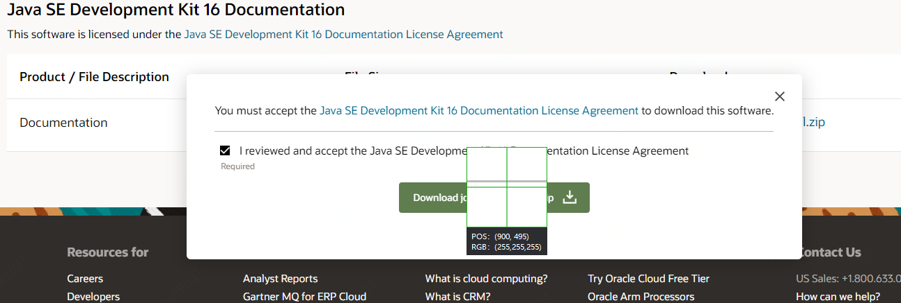
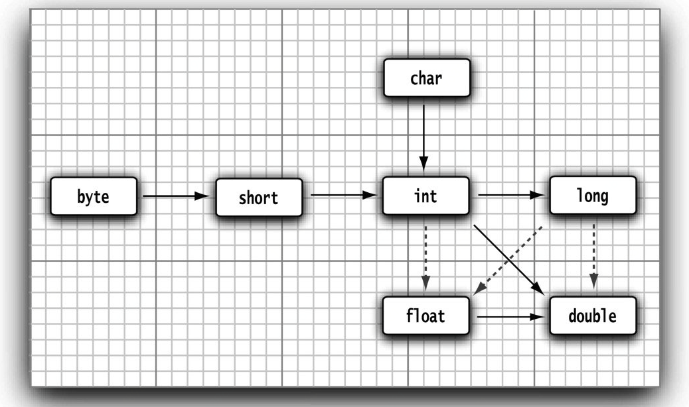

解释虚拟机指令肯定会比全速运行机器指令慢很多。然而，虚拟机有一个选项，可以将执行最频繁的字节码序列翻译成机器码，这一过程被称为即时编译。

Java虚拟机还有一些其他的优点。它可以检测指令序列的行为，从而增强其安全性。


## Java的特点

- 可移植性
- 解释型
- 高性能
- 多线程
- 动态性

## Java 官方的一些源码和文档

- `javasrc` 在JDK的路径上，有一个src.zip，解开后，含了所有公共类库的源代码。 
- `javadoc`  可以从官网下载文档 https://www.oracle.com/java/technologies/javase-downloads。解压后，可以访问目录上的`jdk-16.0.2_doc-all\docs\index.html` 可以在浏览器打开，保存标签，这里可找到所有公共类库的说明。



- 编译器、虚拟机、本地方法以及私有辅助类 http://jdk.java.net/8/ 暂时不看吧。
- 书籍代码学习 https://horstmann.com/corejava/ 可以下载。 

## Java应用程序

**注释**

有三种注释方式， `//`     `/*  */`  第三种注释可以生成文档  `/** */`

```java
// 1、todo 

/* 2、comment */

/**
* 3、This is a doc comment
*/
```

## 数据类型

Java是一种强类型语言。这就意味着必须为每一个变量声明一种类型， 8种基本类型。

`big number ` 大数，是一种对象，不是类型。

8种基本类型

整型 `int`  4个字节

整型 `short` 2个字节

整型 `long` 8个字节

整型 `byte` 1字节

长整型数值有一个后缀L或l（如4000000000L）。 从Java 7开始，加上前缀0b或0B就可以写二进制数。 

浮点型 `float` 4个字节

浮点型 `double` 8个字节

float类型的数值有一个后缀F或f（例如，3.14F）。没有后缀F的浮点数值（如3.14）默认为double类型。当然，也可以在浮点数值后面添加后缀D或d（例如，3.14D）。

三个特殊的值。 

正无穷大  `Double.POSITIVE_INFINITY`

负无穷大 `Double.NEGATIVE_INFINITY`

NaN （不是一个数字） `Double.NaN`

不能这样检测一个特定值是否等于Double.NaN：

```java
if (x== Double.NaN) // is ture 
   
if (Double.isNaN(x)) // check x is "not a number"
```


 char类型 单个字符， 字面量值要用单引号括起来。`'A'`  , `"A"` 是一个字符串。可以表示为十六进制值。其范围从`\u0000`到`\Uffff`。除了转义序列`\u`之外，还有一些用于表示特殊字符的转义序列

Unicode类型 另讲。 

boolean类型。有两个值：false和true，用来判定逻辑条件。**整型值和布尔值之间不能进行相互转换，这一点要注意和C++不一样**。

**枚举类型**

```java
enum Size{SMALL, MEDIUM, LARGE, EXTRA_LARGE} ; 
```


## 变量

在Java中，每个变量都有一个类型（type）。在声明变量时，变量的类型位于变量名之前。 每个声明以分号结束。 

变量名必须是一个以字母开头并由字母或数字构成的序列。 

不能使用Java保留字作为变量名。 

变量名对大小写敏感。 

声明一个变量之后，必须用赋值语句对变量进行**显式初始化**。

利用关键字final指示常量。

```java
final double CM_PER_INCH = 2.54; 
```

 类常量的定义位于main方法的外部。

`const`是 Java 保留的关键字，但目前并没有使用。在Java中，必须使用final定义常量。

## 运算符

在Java中，使用算术运算符`+、-、*、/`表示加、减、乘、除运算。

整数的求余操作（有时称为取模）用`%`s表示.

**数值类型之间的转换**

数值类型之间的合法转换.。 6个实心箭头，表示无信息丢失的转换；有3个虚箭头，表示可能有精度损失的转换。



**强制类型转换**

可能会丢失一些信息。如

```java
double x = 9.997;
int nx = (int)x; 
```

变量 `nx = 9` 小数被截断掉，如果四舍五入用

```java
double x = 9.997;
int nx = (int)Math.round(x);
```

round方法返回的结果为long类型。所以最后要`（int）`转换一下。

**结合赋值和运算符**

和c++ 一样， `+=` 等操作。如：

```java
x += 4; 
```

**自增与自减运算符**

和c++一样。 如 `x++` 、`x--` 、`++n`、 `--n` 。 `++`在前在后有区别， 用在表达式中时，前缀形式会先完成加1；而后缀形式会使用变量原来的值。


**关系和boolean运算符**

基本都沿用了C++的做法。 

`&&`和`||`运算符是按照“短路”方式来求值的：如果第一个操作数已经能够确定表达式的值，第二个操作数就不必计算了。

同样支持三元操作符`？:`

boolean 类型不要做转换。 


## 位运算符

应用在布尔值上时，&和|运算符也会得到一个布尔值。这些运算符与&&和||运算符很类似，不过&和|运算符不采用“短路”方式来求值，也就是说，得到计算结果之前两个操作数都需要计算。

`>>`和`<<`运算符将位模式左移或右移

有一个新知识：** `>>>`运算符会用0填充高位，这与>>不同，它会用符号位填充高位。不存在<<<运算符。**


**括号与运算符级别**

与C或C++不同，Java不使用逗号运算符。不过，可以在for语句的第1和第3部分中使用逗号分隔表达式列表。

## 字符串

标准Java类库中提供了一个预定义类，很自然地叫做String。每个用双引号括起来的字符串都是String类的一个实例。

String类的substring方法可以从一个较大的字符串提取出一个子串。 

substring的工作方式有一个优点：容易计算子串的长度。字符串s.substring(a, b)的长度为b-a。例如，子串“Hel”的长度为3-0=3。

使用+号连接（拼接）两个字符串。 后面可以是int型。 

把多个字符串放在一起，用一个定界符分隔，可以使用静态join方法。 

```java
String all = String.join(" /", "S", "M", "L", "XL"); 
// all is the string  "S / M / L / XL"
```

String类没有提供用于修改字符串的方法。要从原字符串中获取后，重新组成，然后再覆盖回原来的字符串。

不可变字符串却有一个优点：编译器可以让字符串共享 

字符串存放在公共的存储池中。字符串变量指向存储池中相应的位置。如果复制一个字符串变量，原始字符串与复制的字符串共享相同的字符。

使用equals方法检测两个字符串是否相等。如果字符串s与字符串t相等，则返回true；否则，返回false。需要注意，s与t可以是字符串变量，也可以是字符串字面。

要想检测两个字符串是否相等，而不区分大小写，可以使用`equalsIgnoreCase`方法。

一定不要使用==运算符检测两个字符串是否相等！这个运算符只能够确定两个字符串是否放置在同一个位置上。

**空串与Null串**

空串""是长度为0的字符串。可以调用以下代码检查一个字符串是否为空。 空串是一个Java对象，有自己的串长度（0）和内容（空）。

```java
if (str,length() == 0){
    // empty string
}

if (str.equals("")){
    // empty string
}
```

String变量还可以存放一个特殊的值，名为null，这表示目前没有任何对象与该变量关联。

```java
if (str == null){
	// string is null 
}
```

检查一个字符串既不是null也不为空串，这种情况下就需要使用以下条件：**首先要检查str不为null**

```java
if (str != null && str.length() != 0){
    // string is not null or empty
}
```

**码点与代码单元** 

Java字符串由char值序列组成。char数据类型是一个采用UTF-16编码表示Unicode码点的代码单元。大多数的常用Unicode字符使用一个代码单元就可以表示，而辅助字符需要一对代码单元表示。

**构建字符串**

有些时候，需要由较短的字符串构建字符串，例如，按键或来自文件中的单词。采用字符串连接的方式达到此目的效率比较低。每次连接字符串，都会构建一个新的String对象，既耗时，又浪费空间。使用**StringBuilder**类就可以避免这个问题的发生。

```java
StringBuilder builder = new StringBuilder(); 

builder.append(ch); // appends a single character 
builder.append(str) // appends a string 
    
String completeString = builder.toString(); 
```

## 格式化输出

使用`System.out.print(x)`将数值x输出到控制台上。和C语言中的方法一样的。 `printf`和C语言一样。

```java
System.out.printf("%8.2f", x);  //  same to c printf 
```

可以使用静态的String.format方法创建一个格式化的字符串，而不打印输出：

```java
String message = String.format("Hello, %s. Next year, you'll be %d", name, age); 
```

**文件输入与输出**

对文件进行读取，就需要一个用File对象构造一个Scanner对象。如下所示：

```java
Scanner in = new Scanner(Paths.get("myfile.txt"), "UTF-8"); 
```

要想写入文件，就需要构造一个PrintWriter对象。在构造器中，只需要提供文件名：

```java
PrintWriter out = new PrintWriter("myfile.txt", "UTF-8"); 
```

## 控制流程

Java的控制流程结构与C和C++的控制流程结构一样，只有很少的例外情况。没有goto语句，但break语句可以带标签。 foreach循环。

### 块作用域

块（即复合语句）是指由一对大括号括起来的若干条简单的Java语句。块确定了变量的作用域。

不能在嵌套的两个块中声明同名的变量。例如

```java
public static void main(String[] args)
{
    int n; 
    // ...
    {
        int k; 
        int n; // Error  can't redefine n in inner block
        // ... 
    }
}
```

### 条件语句

```java
if (condition){
    statement 
}else {
    statement 
}
```

### 循环

```java
while (condition){
    statement 
}
```

```java
do {
    statement 
}while(condition)
```

```java
for (int i=1 i<=10; i++){
    System.out.println(i); 
}
```
## foreach循环

Java有一种功能很强的循环结构，可以用来依次处理数组中的每个元素（其他类型的元素集合亦可）而不必为指定下标值而分心.。

```java 
for (variable : collection){
    statement 
}
```


## 多重选择：switch语句

```java
int choice = in.nextInt(); 
switch(choice)
{
    case 1: 
        // ...
        break; 
    case 1: 
        // ...
        break;
    default: 
        // bad input 
        break; 
}
```

## 中断控制流程语句

break , goto ，continue 等。 

与C++不同，Java还提供了一种带标签的break语句，用于跳出多重嵌套的循环语句。 

```java
int test()
{
    int n; 
    read_data:
    while (true){
        // ...
        for (int i=0; i<1000; ++i){
            System.out.print("enter anumber >=0:"); 
            n = in.nextInt(); 
            if (n < 0){ // should never  happend-can't go to 
                break read_data; // break out fo read_data loop 
            }
        }
    }
}
```

## 大数值

如果基本的整数和浮点数精度不能够满足需求，那么可以使用`java.math`包中的两个很有用的类：`BigInteger`  和 `BigDecimal`。

这两个类可以处理包含任意长度数字序列的数值。`BigInteger`类实现了任意精度的整数运算，`BigDecimal`实现了任意精度的浮点数运算。 

使用静态的valueOf方法可以将普通的数值转换为大数值：

```java
BigInteger a = BigInteger.valueOf(100); 
BigInteger c = a.add(b); // c = a+b
BigInteger d = c.multiply(b.add(BigInteger.valueOf(2)))// d = c * (b+2)
```


### 数组

数组是一种数据结构，用来存储同一类型值的集合。通过一个整型下标可以访问数组中的每一个值。 

声明了整型数组a：

```java 
int[] a;  // 声明变更a  或 int a[]
int[] a = new int[100] ; 
```


有个更加简单的方式打印数组中的所有值，即利用Arrays类的toString方法。调用Arrays.toString(a)，返回一个包含数组元素的字符串，这些元素被放置在括号内，并用逗号分隔，例如，“[2,3,5,7,11,13]”。要想打印数组，可以调用:

```java 
System.out.println(Arrays,toString(a)); 
```

**数组初始化以及匿名数组**

提供了一种创建数组对象并同时赋予初始值的简化书写形式

```java
int[] smallPrimes = {2, 3, 4,5, 6, 13}; 
```

不需要调用 new。 

初始化一个匿名的数组： 

```java 
new int[] {2, 3, 4,5, 6, 13}; 

smallPrimes = new int[] {2, 3, 4,5, 6, 13}; 
```

**数组拷贝**

在Java中，允许将一个数组变量拷贝给另一个数组变量。这时，两个变量将引用同一个数组.。 

```java 
int [] luckyNumbers = smallPrimes; 
luckyNumbers[5] = 12; // noew smallPrimes[5] is also 12 
```

如果希望将一个数组的所有值拷贝到一个新的数组中去，就要使用Arrays类的`copyOf`方法：

```java 
int[] copiedLickyNumbers = Arrays.copyOf(luckyNumbers, lickyNumbers.length); 
```

第2个参数是新数组的长度。这个方法通常用来增加数组的大小：

```java 
int[] copiedLickyNumbers = Arrays.copyOf(luckyNumbers, 2*lickyNumbers.length); 
```

Java数组与C++数组在堆栈上有很大不同，但基本上与**分配在堆（heap）**上的数组指针一样。

## 命令行参数

每一个Java应用程序都有一个带Stringarg[]参数的main方法。这个参数表明main方法将接收一个字符串数组，也就是命令行参数。

```java
public class Main 
{
    public static void main(String[] args) 
    {
        for (String arg : args) {
            if ("-version".equals(arg)) {
                System.out.println("v10000.0");
                break;
            }
        }
    }
}
```

