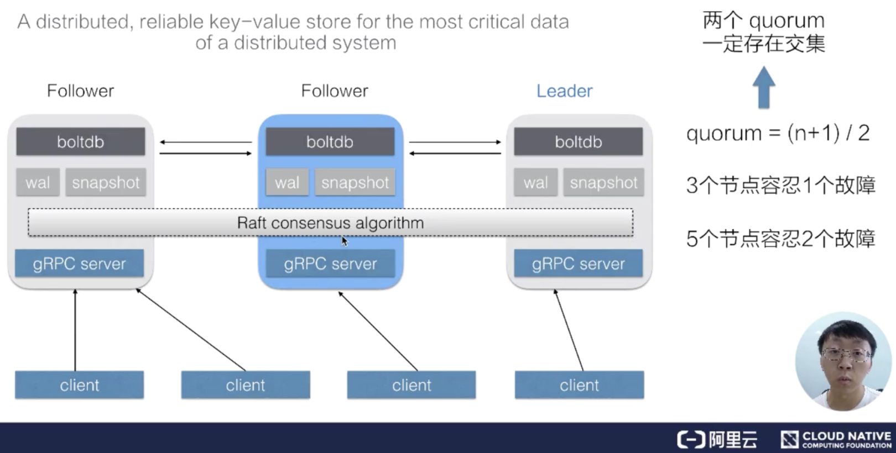
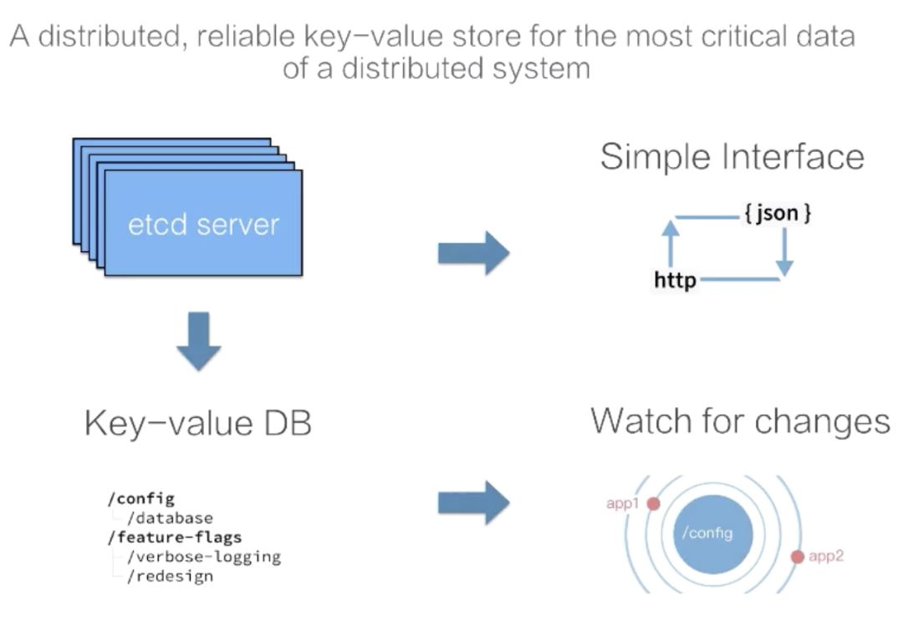
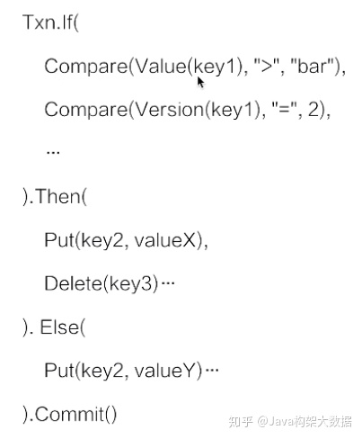
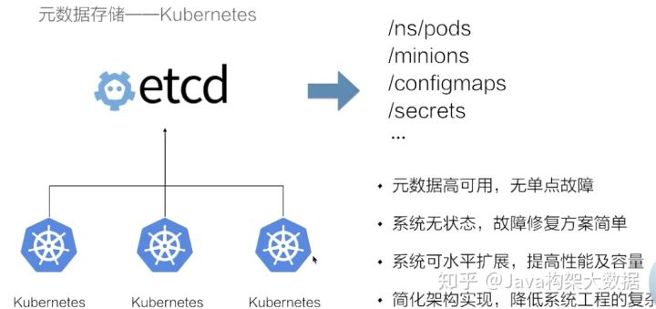
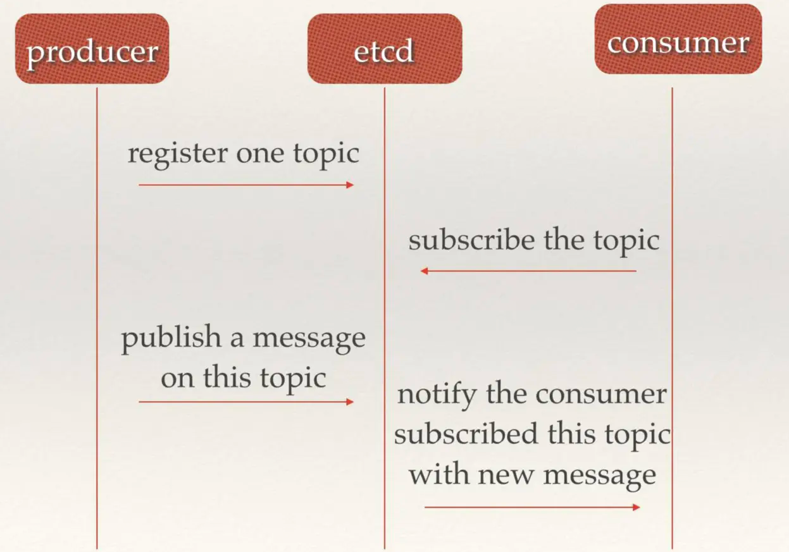

### 一 总体架构

etcd 是一个分布式的、可靠的 key-value 存储系统，它用于存储分布式系统中的关键数据，这个定义非常重要。

一个 etcd 集群，通常会由 3 个或者 5 个节点组成，多个节点之间通过 [**Raft 一致性算法**](https://www.alicharles.com/article/raft/)的完成分布式一致性协同，算法会选举出一个主节点作为 leader，由 leader 负责数据的同步与数据的分发。当 leader 出现故障后系统会自动地选取另一个节点成为 leader，并重新完成数据的同步。

客户端在多个节点中，仅需要选择其中的任意一个就可以完成数据的读写，内部的状态及数据协同由 etcd 自身完成。

quorum =（n+1)/2 n是节点数， quornum 愿意是法定人数， 在raft中超过一增以上的人数就是法定人数。像我们的 zookeeper 也是布置了5台。[zookeeper节点为什么是奇数个？](https://www.jianshu.com/p/35c09d6a02a0) 

Raft 一致性算法能够工作的一个关键点是：任意两个 quorum 的成员之间一定会有一个交集（公共成员），也就是说只要有任意一个 quorum 存活，其中一定存在某一个节点（公共成员），它包含着集群中所有的被确认提交的数据。正是基于这一原理，Raft 一致性算法设计了一套数据同步机制，在 Leader 任期切换后能够重新同步上一个 quorum 被提交的所有数据，从而保证整个集群状态向前推进的过程中保持数据的一致。

* etcd-server 提供简单的接口，有客户端可以访问，也可以用http访问。 
* key-value DB 提供数据存储可理解为一个有序的 map。（因为是一个B-tree） 
* 便客户端去订阅数据的变更，也支持了一个 watch 机制，通过 watch 实时地拿到 etcd 中数据的增量更新，从而实现与 etcd 中的数据同步等业务逻辑。

从 etcd 的架构图中我们可以看到，etcd 主要分为四个部分。

- HTTP Server：用于处理用户发送的 API 请求以及其它 etcd 节点的同步与心跳信息请求。
- Store：用于处理 etcd 支持的各类功能的事务，包括数据索引、节点状态变更、监控与反馈、事件处理与执行等等，是 etcd 对用户提供的大多数 API 功能的具体实现。
- Raft：Raft 强一致性算法的具体实现，是 etcd 的核心。
- WAL：Write Ahead Log（预写式日志），是 etcd 的数据存储方式。除了在内存中存有所有数据的状态以及节点的索引以外，etcd 就通过 WAL 进行持久化存储。WAL 中，所有的数据提交前都会事先记录日志。
  - Snapshot 是为了防止数据过多而进行的状态快照；
  - Entry 表示存储的具体日志内容。

通常，一个用户的请求发送过来，会经由 HTTP Server 转发给 Store 进行具体的事务处理，如果涉及到节点的修改，则交给 Raft 模块进行状态的变更、日志的记录，然后再同步给别的 etcd 节点以确认数据提交，最后进行数据的提交，再次同步。

**etcd与Raft的关系**

* Raft是强一致的集群日志同步算法。
* etcd是一个分布式KV存储。
* etcd利用raft算法在集群中同步key-value。
* 可以理解为Raft协议对日志进行管理，etcd对K/V进行管理。

Raft算法：http://thesecretlivesofdata.com/raft/

### 二 API 介绍

提供简单易用的api接口： 

* Put(key, value) / Deletc (key)
* Get(key) / Get(keyFrom , KeyEnd)
* Watch(key/keyPrefix)
* Transactions(is/then/else ops).Commint()
* Lesases:Grent/Revoke/KeepAlive

增删： put 与 delete 的操作都非常简单，只需要提供一个 key 和一个 value，就可以向集群中写入数据了，删除数据的时候只需要指定 key 即可；

两种查询方式：第一种是指定单个 key 的查询，第二种是指定的一个 key 的范围；

订阅：etcd 提供了 Watch 机制，我们可以利用 watch 实时的订阅到 etcd 中增量的数据更新，watch 支持指定单个 key，也可以指定一个 key 的前缀，在实际应用场景中的通常会采用第二种方式。

事务操作：简单的事务支持，用户可以通过指定一组条件满足时执行某些动作，当条件不成立的时候执行另一组操作，类似于代码中的 if else 语句，etcd 确保整个操作的原子性；

Leases 租约机制。 

### 三 数据版本机制

内部对应数据版本号的基本原理。

term 的概念，代表的是整个集群 Leader 的任期。当集群发生 Leader 切换，term 的值就会 +1。在节点故障，或者 Leader 节点网络出现问题，再或者是将整个集群停止后再次拉起，都会发生 Leader 的切换。

第二个版本号叫做 revision，revision 代表的是全局数据的版本。当数据发生变更，包括创建、修改、删除，其 revision 对应的都会 +1。特别的，在集群中跨 Leader 任期之间，revision 都会保持全局单调递增。

正是 revision 的这一特性，使得集群中任意一次的修改都对应着一个唯一的 revision，因此我们可以通过 revision 来支持数据的 多版本并发控制，也可以支持数据的 Watch。

对于每一个 KeyValue 数据节点，etcd 中都记录了三个版本：

- 第一个版本叫做 create_revision，是 KeyValue 在创建时对应的 revision；
- 第二个叫做 mod_revision，是其数据被操作的时候对应的 revision；
- 第三个 version 就是一个计数器，代表了 KeyValue 被修改了多少次。

在同一个 Leader 任期之内，我们发现所有的修改操作，其对应的 term 值始终都等于 2，而 revision 则保持单调递增。当重启集群之后，我们会发现所有的修改操作对应的 term 值都变成了 3。在新的 Leader 任期内，所有的 term 值都等于3，且不会发生变化，而对应的 revision 值同样保持单调递增。从一个更大的维度去看，可以发现在 term=2 和 term=3 的两个 Leader 任期之间，数据对应的 revision 值依旧保持了全局单调递增。

在 etcd 中支持对同一个 Key 发起多次数据修改，每次数据修改都对应一个版本号。etcd 在实现上记录了每一次修改对应的数据，也就就意味着一个 key 在 etcd 中存在多个历史版本。在查询数据的时候如果不指定版本号，etcd 会返回 Key 对应的最新版本， 

**etcd 也支持指定一个版本号来查询历史数据**。

etcd 将每一次修改都记录下来会导致数据持续增长，这会带来内存及磁盘的空间消耗，同时也会影响 B+tree 的查询效率。为了解决这一问题，在 etcd 中会运行一个**周期性的 压缩机制**来清理历史数据，将一段时间之前的同一个 Key 的多个历史版本数据清理掉。最终的结果是灰色的 b+tree 依旧保持单调递增，但可能会出现一些空洞。

### 四 多版本并发控制 & 订阅

etcd 中所有的数据通过两个b+tree存储在硬盘中， 通过 mmap 的方式映射到内存用来支持快速的访问。灰色的 b+tree 中维护着 revision 到 value 的映射关系，支持通过 revision 查询对应的数据。因为 revision 是单调递增的，当我们通过 watch 来订阅指定 revision 之后的数据时，仅需要订阅该 b+tree 的数据变化即可。

　另一个，它管理着 key 到 revision 的映射关系。当客户端使用 key 查询数据时，首先需要经过蓝色的 btree 将 key 转化为对应的 revision，再通过灰色的 btree 查询到对应的数据。

### 五 微型事务机制

etcd 的事务机制比较简单，基本可以理解为一段 if-else 程序，在 if 中可以提供多个操作。

在 etcd 内部会保证整个事务操作的原子性。也就是说 If 操作所有的比较条件，其看到的视图一定是一致的。同时它能够确保多个操作的原子性不会出现 Then 中的操作仅执行了一半的情况。

通过 etcd 提供的事务操作，我们可以在多个竞争中去保证数据读写的一致性，Kubernetes 项目，它正是利用了 etcd 的事务机制，来实现多个 KubernetesAPI server 对同样一个数据修改的一致性。

### 六 租约机制

lease是分布式系统中一个常见的概念，用于代表一个分布式租约。典型情况下，在分布式系统中需要去检测一个节点是否存活的时，就需要租约机制。

创建了一个 10s 的租约，如果创建租约后不做任何的操作，那么 10s 之后，这个租约就会自动过期。

然后将key1 和 key2 两个 key value 绑定到这个租约之上，这样当租约过期时 etcd 就会自动清理掉 key1 和 key2，使得节点 key1 和 key2 具备了超时自动删除的能力。

如果希望这个租约永不过期，需要周期性的调用 KeeyAlive 方法刷新租约。

比如说需要检测分布式系统中一个进程是否存活，可以在进程中去创建一个租约，并在该进程中周期性的调用 KeepAlive 的方法。如果一切正常，该节点的租约会一致保持，如果这个进程挂掉了，最终这个租约就会自动过期。

在 etcd 中，允许将多个 key 关联在同一个 lease 之上，这个设计是非常巧妙的，可以大幅减少 lease 对象刷新带来的开销。

### 七 典型的使用场景介绍

####  1、元数据存储

Kubernetes 将自身所用的状态存储在 etcd 中，其状态数据的高可用交给 etcd 来解决，Kubernetes 系统自身不需要再应对复杂的分布式系统状态处理，自身的系统架构得到了大幅的简化。

####  2、服务发现

在分布式系统中，通常会出现的一个模式就是需要多个后端（可能是成百上千个进程）来提供一组对等的服务，比如说检索服务、推荐服务。

- 在进程内部启动之后，可以将自身所在的地址注册到 etcd；
- API 网关够通过 etcd 及时感知到后端进程的地址，当后端进程发生故障迁移时会重新注册到 etcd 中，API 网关也能够及时地感知到新的地址；
- 利用 etcd 提供的 Lease 机制，如果提供服务的进程运行过程中出现了异常（crash），API 网关也可以摘除其流量避免调用超时。

通过 etcd 提供的机制可以很容易的实现分布式进程的选主功能，比如可以通过对同一个 key 的事务写来实现抢主的逻辑。一般而言，被选主的 Leader 会将自己的 IP 注册到 etcd 中，使得 Slave 节点能够及时获取到当前的 Leader 地址，从而使得系统按照之前单个 Master 节点的方式继续工作。当 Leader 节点发生异常之后，通过 etcd 能够选取出一个新的节点成为主节点，并且注册新的 IP 之后，Slave 又能够拉取新的主节点的 IP，继续恢复服务。

#### 3、选主

　　在分布式系统中，有一种典型的设计模式就是 Master+Slave。通常情况下，Slave 提供了 CPU、内存、磁盘以及网络等各种资源 ，而 Master 用来调和这些节点以使其对外提供一个服务（比如分布式存储，分布式计算）。典型的分布式存储服务（HDFS）以及分布式计算服务（Hadoop）它们都是采用了类似这样的设计模式。这样的设计模式会有一个典型的问题：**Master 节点的可用性**。当 Master 故障以后，整个集群的服务就挂掉了，没有办法再服务用户的请求。

为了解决这个问题，典型的做法就是启动多个 Master 节点。因为 Master 节点内会包含控制逻辑，多个节点之间的状态同步是非常复杂的，这里最典型的做法就是通过选主的方式，选出其中一个节点作为主节点来提供服务，另一个节点处于等待状态。

 

#### 4、分布式系统并发控制

　　在分布式系统中，当我们去执行一些任务，比如说去升级 OS、或者说升级 OS 上的软件的时候、又或者去执行一些计算任务的时候，出于对后端服务的瓶颈或者是业务稳定性的考虑，通常情况下需要控制任务的并发度。如果该任务缺少一个调和的 Master 节点，可以通过 etcd 来完成这样的分布式系统工作。

在这个模式中通过 etcd 去实现一个分布式的信号量，并且可以利用 etcd leases 机制来实现自动地剔除掉故障节点。在进程执行过程中，如果进程的运行周期比较长，我们可以将进程运行过程中的一些状态数据存储到 etcd，从而使得当进程故障之后且需要恢复到其他地方时，能够从 etcd 中去恢复一些执行状态，而不需要重新去完成整个的计算逻辑，以此来加速整个任务的执行效率。

#### 5、消息发布与订阅

etcd 可以充当消息中间件，生产者可以往etcd中注册 topic 并发送消息，消费者从 etcd 中订阅 topic ，来获取生产者发送至etcd中的消息。

#### 6、分布式锁

当有多个竞争者node节点，etcd作为总控，在分布式集群中与一个节点成功分配lock。

### 八 etcd vs Zookeeper 

#### 1、Zookeeper 优点

* 非阻塞全部快照（达成最终一致）
* 高效的内存管理
* 高可靠
* API 简单
* 连接管理可以自动重试
* ZooKeeper recipes 的实现是经过完整良好的测试的。
* 有一套框架使得写新的 ZooKeeper recipes 非常简单。
* 支持监听事件
* 发生网络分区时，各个区都会开始选举 leader，那么节点数少的那个分区将会停止运行。

#### 2、Zookeeper 缺点

* zookeeper 是 java 写的，那么自然就会继承 java 的缺点，例如 GC 暂停。
* 如果开启了快照，数据会写入磁盘，此时 zookeeper 的读写操作会有一个暂时的停顿。
* 对于每个 watch 请求，zookeeper 都会打开一个新的 socket 连接，这样 zookeeper 就需要实时管理很多 socket 连接，比较复杂

#### 3、etcd 优点

* 支持增量快照，避免了 zookeeper 的快照暂停问题
* 堆外存储，没有垃圾回收暂停问题
* 无需像 zookeeper 那样为每个 watch 都做个 socket 连接，可以复用
* zookeeper 每个 watch 只能收到一次事件通知，etcd 可以持续监控，在一次 watch 触发之后无需再次设置一次 watch
* zookeeper 会丢弃事件，etcd3 持有一个事件窗口，在 client 断开连接后不会丢失所有事件

#### 3、etcd 缺点

* 如果超时，或者 client 与 etcd 网络中断，client 不会明确的知道当前操作的状态
* 在 leader 选举时，etcd 会放弃操作，并且不会给 client 发送放弃响应
* 在网络分区时，当 leader 处于小分区时，读请求会继续被处理

zookeeper 是用 java 开发的，被 Apache 很多项目采用。

etcd 是用 go 开发的，主要是被 Kubernetes 采用。

zookeeper 非常稳定，是一个著名的分布式协调系统，etcd 是后起之秀，前景广阔。

因为 etcd 是用 go 写的，现在还没有很好的 java 客户端库，需要通过 http 方式调用。

一文入门ETCD https://juejin.im/post/6844904031186321416
深入浅出etcd之raft实现 https://cloud.tencent.com/developer/article/1394643

