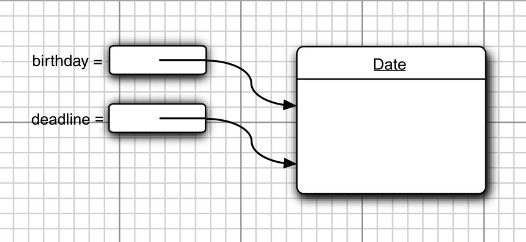

## 对象

对象的三个主要特性：

- 对象的行为（behavior）
- 对象的状态（state）
- 对象标识（identity）

类之间的关系:

依赖（“uses-a”） : 如果一个类的方法操纵另一个类的对象，我们就说一个类依赖于另一个类。应该尽可能地将相互依赖的类减至最少。

聚合（“has-a”）：聚合关系意味着类A的对象包含类B的对象。更加喜欢使用“关联”这个术语。

继承（“is-a”）：是一种用于表示特殊与一般关系的

### 对象与对象变量

要想使用对象，就必须首先构造对象，并指定其初始状态。然后，对对象应用方法。

使用构造器（constructor）构造新实例。构造器是一种特殊的方法，用来构造并初始化对象。 类似c++中的构造函数。

以Date类为例：

```java
Date birthday = new Date(); 
String s = new Date().toString();
```

对象与对象变量之间存在着一个重要的区别:

 ```java 
 Date deadline; 			 // deadllne dosen't refer to any object 
 s = deadline.toString(); // not yet
 deadline = birthday; 	 // refer to same object 
 ```

定义了一个对象变量deadline，它可以引用Date类型的对象。但是，一定要认识到：变量deadline不是一个对象，实际上也没有引用对象。此时，不能将任何Date方法应用于这个变量上。这一点和C++ 有区别，c++定义了对象变量，即是一个可以用的对象，只是它在栈中，不在堆中。



**一个对象变量并没有实际包含一个对象，而仅仅引用一个对象。**

很多人错误地认为Java对象变量与C++的引用类似。然而，在C++中没有空引用，并且引用不能被赋值。**可以将Java的对象变量看作C++的对象指针**。


### 更改器方法与访问器方法

调用一个方法后，只是把一个对象赋给另一个对象变量。原来的对象不做任何改动。这种叫访问器方法（accessor method）


调用一个方法手， 对象的数据被更改，叫更改器方法。（mutator method）

```java
LocalData aThousandDaysLater = newYearsEve.plusDays(1000);  // accessor method

sameDay.add(Calender.DAY_OF_MONTH,100); // mutator method
```


